# Document Acquisition and Parsing Pipeline

This document describes the end-to-end pipeline for acquiring documents from external APIs, parsing them into normalized text, and preparing them for extraction.

## Pipeline Overview

```mermaid
flowchart TD
    %% Step 1: References Ingestion
    START([User Query]) --> REFS[References Service]
    
    REFS --> OA[OpenAlex API<br/>PyAlex client]
    REFS --> OV[Overton API<br/>OvertonClient]
    REFS --> MC[Media Cloud API<br/>Future]
    
    OA --> NORM1[Normalize to<br/>UnifiedReference]
    OV --> NORM1
    MC --> NORM1
    
    NORM1 --> CSV1[References CSV<br/>pandas DataFrame]
    
    %% Step 1.5: Relevance Checking
    CSV1 --> REL{Relevance<br/>Enabled?}
    REL -->|Yes| RELSVC[Relevance Service<br/>LLM: gpt-5-mini]
    RELSVC --> RELPROMPT[LLM Prompt:<br/>Title + Abstract<br/>vs Query]
    RELPROMPT --> CSV2[Updated CSV<br/>is_relevant flag]
    REL -->|No| CSV2
    
    %% Step 1.75: Evidence Categorisation
    CSV2 --> EVID{Evidence<br/>Categorisation}
    EVID --> EVIDSVC[EvidenceCategoryService<br/>LLM: gpt-5.2]
    EVIDSVC --> EVIDPROMPT[LLM Prompt:<br/>Title + Abstract + Metadata<br/>→ 9 categories]
    EVIDPROMPT --> CSV3[Updated CSV<br/>evidence_category]
    
    %% Step 2: Acquisition
    CSV3 --> FILTER[Filter:<br/>is_relevant = True<br/>AND<br/>evidence_category ≠<br/>'Other Non-evidence']
    FILTER --> ACQ[Acquisition Service<br/>AcquisitionService]
    
    ACQ --> PDFTRY{Try PDF URL<br/>pdf_url}
    PDFTRY -->|Success| PDFDL[Download PDF<br/>httpx.AsyncClient]
    PDFTRY -->|Fail| LANDING{Try Landing Page<br/>landing_page_url}
    
    LANDING --> HTMLSCRAPE1[Scrape HTML<br/>async_fetch_html<br/>scrapling/BeautifulSoup]
    HTMLSCRAPE1 --> PDFDISCOVER{Discover PDF<br/>on page?}
    PDFDISCOVER -->|Found| PDFDL2[Download PDF<br/>httpx.AsyncClient]
    PDFDISCOVER -->|Not Found| HTMLSAVE[Save HTML<br/>.html file]
    LANDING -->|Fail| DOITRY{Try DOI URL<br/>doi.org}
    
    DOITRY --> HTMLSCRAPE2[Scrape DOI Landing<br/>async_fetch_html]
    HTMLSCRAPE2 --> PDFDISCOVER2{Discover PDF<br/>on page?}
    PDFDISCOVER2 -->|Found| PDFDL3[Download PDF]
    PDFDISCOVER2 -->|Not Found| HTMLSAVE2[Save HTML]
    
    PDFDL --> RAW[Raw Files<br/>data/raw/]
    PDFDL2 --> RAW
    PDFDL3 --> RAW
    HTMLSAVE --> RAW
    HTMLSAVE2 --> RAW
    
    %% Step 3: Parsing
    RAW --> PARSE[Parsing Service<br/>ParsingService]
    
    PARSE --> PDFCHECK{File Type?}
    PDFCHECK -->|PDF| PDFPARSE[Parse PDF<br/>PyMuPDF fitz]
    PDFCHECK -->|HTML| HTMLPARSE[Parse HTML<br/>Scrapling Fetcher<br/>OR BeautifulSoup]
    
    PDFPARSE --> PDFGUARD{Size Guardrails<br/>MAX_PDF_SIZE_MB<br/>MAX_PDF_PAGES}
    PDFGUARD -->|Pass| PDFTEXT[Extract Text<br/>page.get_text]
    PDFGUARD -->|Fail| SKIP[Skip Document]
    
    HTMLPARSE --> HTMLTEXT[Extract Text<br/>get_all_text<br/>OR<br/>soup.select + get_text]
    
    PDFTEXT --> NORM[Text Normalization<br/>normalize_text]
    HTMLTEXT --> NORM
    
    NORM --> NORMFILES[Normalized Files<br/>data/normalized/<br/>.txt files]
    
    %% Step 4: Extraction Preparation
    NORMFILES --> EXTRACT[LangChain Extractor<br/>LangChainExtractorService]
    
    EXTRACT --> WORKFLOW{Workflow Routing<br/>Based on<br/>evidence_category}
    
    WORKFLOW -->|RCT/Observational| RCTWF[RCT Workflow<br/>LangGraph StateGraph]
    WORKFLOW -->|Systematic Review| SRWF[SR Workflow<br/>LangGraph StateGraph]
    WORKFLOW -->|Policy| POLWF[Policy Workflow<br/>LangGraph StateGraph]
    
    RCTWF --> EXTRES[Extraction Results<br/>Structured JSON]
    SRWF --> EXTRES
    POLWF --> EXTRES
    
    EXTRES --> STORAGE[(Supabase<br/>analysis_extractions)]
    
    %% Styling
    classDef api fill:#e3f2fd,stroke:#1976d2,stroke-width:2px
    classDef llm fill:#fff3e0,stroke:#f57c00,stroke-width:2px
    classDef tool fill:#f3e5f5,stroke:#7b1fa2,stroke-width:2px
    classDef storage fill:#e8f5e9,stroke:#388e3c,stroke-width:2px
    classDef decision fill:#fff9c4,stroke:#f9a825,stroke-width:2px
    
    class OA,OV,MC api
    class RELSVC,EVIDSVC,RELPROMPT,EVIDPROMPT llm
    class PDFDL,PDFDL2,PDFDL3,HTMLSCRAPE1,HTMLSCRAPE2,PDFPARSE,HTMLPARSE,NORM tool
    class CSV1,CSV2,CSV3,RAW,NORMFILES,STORAGE storage
    class REL,EVID,PDFTRY,LANDING,PDFDISCOVER,DOITRY,PDFDISCOVER2,PDFCHECK,PDFGUARD,WORKFLOW decision
```



## Tools and Technologies by Stage

### 1. References Ingestion

| Tool/Technology | Purpose | Implementation |
|----------------|---------|---------------|
| **OpenAlex API** | Academic literature search | `app/services/openalex.py` → PyAlex client |
| **Overton API** | Policy document search | `app/utils/overton.py` → OvertonClient |
| **Media Cloud API** | Media articles (planned) | Future implementation |
| **pandas** | Data normalization and CSV export | DataFrame operations |

**Output**: `references.csv` with unified schema (`UnifiedReference`)

### 2. Relevance Checking

| Tool/Technology | Purpose | Implementation |
|----------------|---------|---------------|
| **LLM (gpt-5-mini)** | Relevance classification | `app/services/analysis/relevance.py` |
| **LangChain** | Prompt management | ChatPromptTemplate |
| **Structured Output** | Binary classification | Pydantic schema |

**Input**: Title + Abstract + Query  
**Output**: `is_relevant` boolean flag

### 3. Evidence Categorisation

| Tool/Technology | Purpose | Implementation |
|----------------|---------|---------------|
| **LLM (gpt-5.2)** | 9-category classification | `app/services/analysis/evidence/category.py` |
| **Batch Processing** | Efficient LLM calls | `app/utils/llm/batch_check.py` |
| **Structured Output** | Category + confidence | Pydantic schema |

**Input**: Title + Abstract + Metadata  
**Output**: `evidence_category` (9 categories) + `evidence_confidence`

### 4. Acquisition (Download)

| Tool/Technology | Purpose | Implementation |
|----------------|---------|---------------|
| **httpx** | HTTP client for PDF/HTML download | `httpx.AsyncClient` |
| **scrapling** | Robust HTML extraction | `scrapling.fetchers.Fetcher` |
| **BeautifulSoup** | HTML parsing fallback | `bs4.BeautifulSoup` |
| **asyncio** | Concurrent downloads | `asyncio.Semaphore(concurrency=5)` |

**Download Strategy**:
1. Try `pdf_url` directly
2. Fallback to `landing_page_url` → scrape HTML → discover PDF link
3. Fallback to `doi.org` URL → scrape HTML → discover PDF link
4. Save HTML if PDF not found

**Output**: Raw files in `data/raw/` (`.pdf` or `.html`)

### 5. Parsing

| Tool/Technology | Purpose | Implementation |
|----------------|---------|---------------|
| **PyMuPDF (fitz)** | PDF text extraction | `fitz.open()` → `page.get_text()` |
| **Scrapling** | HTML text extraction (preferred) | `Fetcher.from_file()` → `get_all_text()` |
| **BeautifulSoup** | HTML fallback | `BeautifulSoup(html, 'lxml')` → CSS selectors |
| **asyncio** | Async execution | `loop.run_in_executor()` |

**Guardrails**:
- PDF: `MAX_PDF_SIZE_MB`, `MAX_PDF_PAGES`, `MAX_TEXT_LENGTH_CHARS`
- HTML: Timeout limits, content length checks

**Output**: Normalized text files in `data/normalized/` (`.txt`)

### 6. Text Normalization

| Tool/Technology | Purpose | Implementation |
|----------------|---------|---------------|
| **normalize_text()** | Unicode normalization, whitespace cleanup | `app/services/analysis/normalize.py` |

**Operations**:
- Unicode normalization (NFKC)
- Whitespace collapse
- Encoding fixes

### 7. Extraction (LangChain Workflows)

| Tool/Technology | Purpose | Implementation |
|----------------|---------|---------------|
| **LangGraph** | Workflow orchestration | `StateGraph` with nodes |
| **LangChain** | LLM integration | ChatOpenAI with structured output |
| **Pydantic** | Schema validation | Extraction schemas |
| **Workflow Routing** | Evidence-category-based routing | `app/services/analysis/workflows/routing.py` |

**Workflow Types**:
- **RCT Workflow**: Issues → Interventions → Mappings → Results → Conclusions
- **SR Workflow**: Specialized for meta-analytic data
- **Policy Workflow**: Claim-level extraction

**Output**: Structured extractions stored in Supabase `analysis_extractions` table

## Data Flow Summary

```
User Query
  ↓
[OpenAlex/Overton APIs] → UnifiedReference → references.csv
  ↓
[Relevance LLM] → is_relevant flag
  ↓
[Evidence Category LLM] → evidence_category
  ↓
[Acquisition Service] → PDF/HTML files (data/raw/)
  ↓
[Parsing Service] → Normalized text (data/normalized/)
  ↓
[LangChain Extractor] → Structured extractions → Supabase
```

## Key Design Decisions

1. **Filtering Strategy**: Only acquire full texts for documents that are:
   - `is_relevant = True`
   - `evidence_category ≠ "Other (Non-evidence documents)"`

2. **Download Priority**: PDF → Landing Page HTML → DOI Landing Page HTML

3. **Parsing Robustness**: Scrapling (preferred) → BeautifulSoup (fallback)

4. **Guardrails**: Size limits prevent processing of extremely large documents

5. **Workflow Routing**: Evidence category determines which extraction workflow to use

