# Document Extraction Pipeline

This document describes the LangChain/LangGraph-based extraction system that transforms normalized document text into structured extraction data.

## Pipeline Overview

```mermaid
flowchart TD
    %% Input
    START([Normalized Text Files<br/>data/normalized/*.txt]) --> EXTSVC[LangChain Extractor Service<br/>LangChainExtractorService]
    
    %% Filtering
    EXTSVC --> FILTER1{Check Existing<br/>Extractions?}
    FILTER1 -->|Yes| CHECKDB[(Supabase<br/>analysis_extractions)]
    CHECKDB -->|Found| SKIP[Skip Document]
    CHECKDB -->|Not Found| PROC[Process Document]
    FILTER1 -->|No| PROC
    
    %% Workflow Routing
    PROC --> ROUTE[Workflow Router<br/>create_workflow]
    ROUTE --> CAT{Evidence Category<br/>+ Confidence}
    
    CAT -->|Systematic Review<br/>confidence ≥ 0.5| SRWF[SR Workflow<br/>SRExtractionWorkflow]
    CAT -->|RCT/Observational<br/>OR<br/>confidence < 0.5| RCTWF[RCT Workflow<br/>RCTExtractionWorkflow]
    CAT -->|Policy Documents| POLWF[Policy Workflow<br/>PolicyExtractionWorkflow]
    
    %% Stage 1: Issues
    SRWF --> STAGE1[Stage A: Extract Issues<br/>LLM: gpt-5-mini]
    RCTWF --> STAGE1
    POLWF --> STAGE1
    
    STAGE1 --> ISSUEPROMPT[LLM Prompt:<br/>ISSUES_PROMPT<br/>+ Full Text]
    ISSUEPROMPT --> ISSUEJSON[Structured Output:<br/>IssuesExtraction<br/>1-3 IssueItem]
    ISSUEJSON --> ISSUEVAL[Pydantic Validation]
    ISSUEVAL --> STATE1[WorkflowState<br/>issues: List]
    
    %% Stage 2: Interventions
    STATE1 --> STAGE2[Stage B: Extract Interventions<br/>LLM: gpt-5-mini]
    STAGE2 --> INTERVPROMPT[LLM Prompt:<br/>INTERVENTIONS_PROMPT<br/>+ Full Text<br/>+ Evidence Context]
    INTERVPROMPT --> EVIDCTX[Evidence Strength Context<br/>calculate_document_evidence_score<br/>Category + Sample Size]
    EVIDCTX --> INTERVJSON[Structured Output:<br/>InterventionsExtraction<br/>2-6 InterventionItem]
    INTERVJSON --> INTERVVAL[Pydantic Validation]
    INTERVVAL --> STATE2[WorkflowState<br/>interventions: List]
    
    %% Stage 3: Mappings
    STATE2 --> STAGE3[Stage C: Extract Mappings<br/>LLM: gpt-5-mini]
    STAGE3 --> MAPPROMPT[LLM Prompt:<br/>MAPPING_PROMPT<br/>+ Full Text<br/>+ Issues JSON<br/>+ Interventions JSON]
    MAPPROMPT --> MAPJSON[Structured Output:<br/>MappingsExtraction<br/>MappingItem per link]
    MAPJSON --> MAPVAL[Pydantic Validation]
    MAPVAL --> STATE3[WorkflowState<br/>mappings: List]
    
    %% Stage 4: Results (Per-Intervention Loop)
    STATE3 --> STAGE4[Stage D: Extract Results<br/>LLM: gpt-5-mini]
    STAGE4 --> LOOP{For Each<br/>Intervention}
    LOOP --> RESULTPROMPT[LLM Prompt:<br/>RESULTS_PROMPT<br/>+ Full Text<br/>+ Single Intervention]
    RESULTPROMPT --> RESULTJSON[Structured Output:<br/>ResultsExtraction<br/>1-5 ResultItem]
    RESULTJSON --> RESULTVAL[Pydantic Validation]
    RESULTVAL --> LOOP
    LOOP -->|All Done| STATE4[WorkflowState<br/>results: List]
    
    %% Stage 5: Conclusions
    STATE4 --> STAGE5[Stage E: Extract Conclusions<br/>LLM: gpt-5-mini]
    STAGE5 --> CONCLPROMPT[LLM Prompt:<br/>CONCLUSIONS_PROMPT<br/>+ Full Text<br/>+ All Extractions JSON]
    CONCLPROMPT --> CONCLJSON[Structured Output:<br/>ConclusionsExtraction<br/>ConclusionItem]
    CONCLJSON --> CONCLVAL[Pydantic Validation]
    CONCLVAL --> STATE5[WorkflowState<br/>conclusion: ConclusionItem]
    
    %% Evidence Strength Calculation
    STATE5 --> EVIDCALC[Calculate Evidence Strength<br/>calculate_document_evidence_score]
    EVIDCALC --> SAMPLESIZE[Extract Sample Size<br/>from Interventions]
    SAMPLESIZE --> PENALTY{Sample Size<br/>< 100 AND<br/>Causal Category?}
    PENALTY -->|Yes| APPLYPENALTY[Apply -1 Star Penalty]
    PENALTY -->|No| NOPENALTY[No Penalty]
    APPLYPENALTY --> EVIDSTR[Evidence Strength<br/>stars: 0-5]
    NOPENALTY --> EVIDSTR
    EVIDSTR --> UPDATECONCL[Update Conclusion<br/>evidence_strength field]
    
    %% Validation
    UPDATECONCL --> VALIDATE[Stage F: Validate & Filter<br/>validate_and_filter]
    VALIDATE --> QUOTECHECK[Quote Validation<br/>_fuzzy_quote_match]
    QUOTECHECK --> EXACT{Exact Match<br/>in Text?}
    EXACT -->|Yes| KEEP1[Keep Item]
    EXACT -->|No| FUZZY{Fuzzy Match<br/>threshold ≥ 0.7?}
    FUZZY -->|Yes| KEEP2[Keep Item]
    FUZZY -->|No| REMOVE[Remove Item]
    
    KEEP1 --> REFCHECK[Reference Validation<br/>Check Index Validity]
    KEEP2 --> REFCHECK
    REFCHECK --> CASCADE[Cascade Filtering<br/>Remove Dependent Items]
    CASCADE --> FINALSTATE[Final WorkflowState<br/>Validated Extractions]
    
    %% Storage
    FINALSTATE --> STORAGE[Storage Service<br/>AnalysisStorageService]
    STORAGE --> TRANSFORM[Transform to DB Schema<br/>DocumentExtractionBundle]
    TRANSFORM --> WRITE[(Supabase<br/>analysis_extractions<br/>analysis_documents)]
    
    %% Error Handling
    STAGE1 -.->|Error| ERR1[Error State<br/>Empty List]
    STAGE2 -.->|Error| ERR2[Error State<br/>Empty List]
    STAGE3 -.->|Error| ERR3[Error State<br/>Empty List]
    STAGE4 -.->|Error| ERR4[Error State<br/>Empty List]
    STAGE5 -.->|Error| ERR5[Error State<br/>None]
    ERR1 --> STAGE2
    ERR2 --> STAGE3
    ERR3 --> STAGE4
    ERR4 --> STAGE5
    ERR5 --> VALIDATE
    
    %% Styling
    classDef llm fill:#fff3e0,stroke:#f57c00,stroke-width:2px
    classDef workflow fill:#e3f2fd,stroke:#1976d2,stroke-width:2px
    classDef validation fill:#f3e5f5,stroke:#7b1fa2,stroke-width:2px
    classDef storage fill:#e8f5e9,stroke:#388e3c,stroke-width:2px
    classDef decision fill:#fff9c4,stroke:#f9a825,stroke-width:2px
    classDef error fill:#ffebee,stroke:#c62828,stroke-width:1px,stroke-dasharray:5 5
    
    class STAGE1,STAGE2,STAGE3,STAGE4,STAGE5,ISSUEPROMPT,INTERVPROMPT,MAPPROMPT,RESULTPROMPT,CONCLPROMPT llm
    class SRWF,RCTWF,POLWF,ROUTE workflow
    class VALIDATE,QUOTECHECK,REFCHECK,CASCADE validation
    class STORAGE,WRITE,CHECKDB storage
    class FILTER1,CAT,LOOP,PENALTY,EXACT,FUZZY decision
    class ERR1,ERR2,ERR3,ERR4,ERR5 error
```



## Extraction Stages Detail

### Stage A: Issues Extraction

| Component | Details |
|-----------|---------|
| **LLM Model** | `gpt-5-mini` (default) or per-stage config |
| **Prompt** | `ISSUES_PROMPT` |
| **Input** | Full document text |
| **Output Schema** | `IssuesExtraction` (Pydantic) |
| **Expected Output** | 1-3 `IssueItem` objects |
| **Key Fields** | `label`, `explanation`, `supporting_quote`, `quote_location` |

**Purpose**: Extract key problem statements that motivated the research/policy.

### Stage B: Interventions Extraction

| Component | Details |
|-----------|---------|
| **LLM Model** | `gpt-5-mini` (default) |
| **Prompt** | `INTERVENTIONS_PROMPT` |
| **Input** | Full text + Evidence strength context |
| **Evidence Context** | Category, confidence, sample size (calculated dynamically) |
| **Output Schema** | `InterventionsExtraction` (Pydantic) |
| **Expected Output** | 2-6 `InterventionItem` objects |
| **Key Fields** | `name`, `type`, `study_type`, `country`, `sample_size`, `supporting_quote` |

**Purpose**: Extract active interventions/programs evaluated.

**Special Features**:
- Evidence strength context injected into prompt
- Sample size extracted for later penalty calculation
- Maryland Scientific Methods Scale classification (RCT workflow)

### Stage C: Mappings Extraction

| Component | Details |
|-----------|---------|
| **LLM Model** | `gpt-5-mini` (default) |
| **Prompt** | `MAPPING_PROMPT` |
| **Input** | Full text + Issues JSON + Interventions JSON |
| **Output Schema** | `MappingsExtraction` (Pydantic) |
| **Expected Output** | `MappingItem` per issue-intervention link |
| **Key Fields** | `issue_idx`, `intervention_idx`, `rationale`, `supporting_quote` |

**Purpose**: Link issues to interventions with grounded rationale.

### Stage D: Results Extraction

| Component | Details |
|-----------|---------|
| **LLM Model** | `gpt-5-mini` (default) |
| **Prompt** | `RESULTS_PROMPT` |
| **Input** | Full text + Single intervention (per-intervention loop) |
| **Output Schema** | `ResultsExtraction` (Pydantic) |
| **Expected Output** | 1-5 `ResultItem` objects per intervention |
| **Key Fields** | `outcome_variable`, `effect_direction`, `effect_size`, `p_value`, `sample_size`, `supporting_quote` |

**Purpose**: Extract quantitative results for each intervention separately.

**Loop Structure**: Processes each intervention individually to maintain focus.

### Stage E: Conclusions Extraction

| Component | Details |
|-----------|---------|
| **LLM Model** | `gpt-5-mini` (default) |
| **Prompt** | `CONCLUSIONS_PROMPT` |
| **Input** | Full text + All extractions JSON (issues, interventions, mappings, results) |
| **Output Schema** | `ConclusionsExtraction` (Pydantic) |
| **Expected Output** | Single `ConclusionItem` |
| **Key Fields** | `summary`, `key_takeaways`, `limitations`, `supporting_quote` |

**Purpose**: Extract overall document conclusions and key takeaways.

### Evidence Strength Calculation

After interventions are extracted, the system calculates evidence strength:

1. **Extract Sample Size**: From `interventions[0].sample_size`
2. **Check Penalty Conditions**:
   - Evidence category is causal (RCT or Observational)
   - Sample size is known and < 100
3. **Apply Penalty**: `-1 star` if conditions met
4. **Store Result**: Update `conclusion.evidence_strength.stars`

**Implementation**: `calculate_document_evidence_score()` in `evidence/strength.py`

### Stage F: Validation & Filtering

| Component | Details |
|-----------|---------|
| **Method** | `_validate_and_filter()` |
| **Quote Validation** | `_fuzzy_quote_match()` with threshold 0.7 |
| **Reference Validation** | Check all index references exist |
| **Cascade Filtering** | Remove dependent items if parent removed |

**Validation Steps**:
1. **Quote Grounding**: Verify `supporting_quote` exists in source text
   - Try exact substring match first
   - Fall back to fuzzy matching (word overlap)
   - Threshold: 0.7 similarity
2. **Index Integrity**: Ensure all `issue_idx`, `intervention_idx` references are valid
3. **Cascade Removal**: If an intervention is removed, remove dependent mappings and results

## Workflow Types

### RCT Workflow (`RCTExtractionWorkflow`)

**Used For**:
- RCTs and Quasi-Experimental Studies
- Observational Research Studies
- Low-confidence systematic reviews (confidence < 0.5)
- Unknown/Insufficient information (fallback)

**Special Features**:
- Maryland Scientific Methods Scale classification
- Detailed population demographics extraction
- Quantitative effect size extraction

### SR Workflow (`SRExtractionWorkflow`)

**Used For**:
- Systematic Review and Meta-Analysis (confidence ≥ 0.5)

**Special Features**:
- Meta-analytic data extraction (`n_studies`, `heterogeneity_I2`, `tau2`)
- Study inclusion/exclusion criteria
- Pooled effect sizes

### Policy Workflow (`PolicyExtractionWorkflow`)

**Used For**:
- Policy Syntheses & Guidance Documents
- Qualitative & Contextual Evidence
- Expert Opinion and Commentary

**Special Features**:
- Claim-level extraction (not empirical results)
- Responsible actor identification
- Implementation level classification
- No empirical fields (effect_size, p_value, etc.)

## Tools and Technologies

| Tool/Technology | Purpose | Implementation |
|----------------|---------|----------------|
| **LangGraph** | Workflow orchestration | `StateGraph` with sequential nodes |
| **LangChain** | LLM integration | `ChatOpenAI` with structured output |
| **Pydantic** | Schema validation | Extraction schemas (`IssuesExtraction`, etc.) |
| **rapidfuzz** | Fuzzy quote matching | Word overlap analysis |
| **asyncio** | Concurrent processing | `asyncio.Semaphore` for batch control |
| **Langfuse** | Observability | Tracing all LLM calls |

## Data Flow Summary

```
Normalized Text
  ↓
[Workflow Router] → Select workflow (RCT/SR/Policy)
  ↓
[Stage A: Issues] → LLM extraction → Pydantic validation
  ↓
[Stage B: Interventions] → LLM extraction → Extract sample_size → Calculate evidence strength
  ↓
[Stage C: Mappings] → LLM extraction → Link issues to interventions
  ↓
[Stage D: Results] → Per-intervention loop → LLM extraction per intervention
  ↓
[Stage E: Conclusions] → LLM extraction → Calculate evidence strength → Update conclusion
  ↓
[Stage F: Validation] → Quote validation → Reference check → Cascade filtering
  ↓
[Storage] → Transform to DB schema → Write to Supabase
```

## Key Design Principles

1. **MECE Compliance**: Mutually Exclusive, Collectively Exhaustive extractions
2. **Verbatim Grounding**: Every extracted item must have exact quote from source
3. **Index-based References**: Simple integer indices for referential integrity
4. **Graceful Degradation**: Individual stage failures don't halt entire workflow
5. **Post-hoc Validation**: Quote authenticity verified after extraction
6. **Evidence Strength Integration**: Calculated during extraction, stored in conclusion

## Error Handling

- **Node-level**: Each stage catches exceptions and returns empty list/None
- **Workflow-level**: Final state checked for errors before returning results
- **Retry Logic**: Configurable retries per stage (default: 1 retry)
- **Partial Success**: Validated items retained even if some stages fail

## Performance Characteristics

- **Latency**: ~15-30 seconds per document (5 stages + per-intervention results)
- **Concurrency**: Controlled by `BATCH_SIZE_EXTRACTION` (default: 5)
- **Cost**: ~$0.01-0.05 per document (depending on length and model)
- **Accuracy**: High grounding rate via fuzzy quote validation

## Storage Schema

Extractions are stored in Supabase:

- **`analysis_extractions`**: One row per extracted item (issue, intervention, result, etc.)
- **`analysis_documents`**: Document-level metadata updated with extraction status
- **Structured Format**: JSON stored in `raw_data` field, normalized fields for querying

