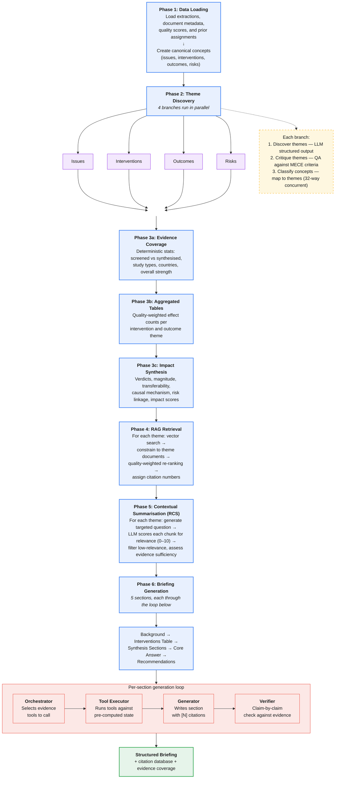

# Synthesis methodology

This document describes the full methodology by which Policy Atlas transforms
screened document extractions into an executive briefing.  It covers the
end-to-end pipeline, from raw data loading through theme discovery,
evidence retrieval, contextual summarisation, impact assessment, and
tool-augmented briefing generation with mandatory verification.

For detailed impact assessment methodology (verdicts, magnitude,
transferability, causal mechanism, harm warnings, scalar scores), see
[impact_assessment.md](impact_assessment.md).

---

## Contents

1. [Overview](#overview)
2. [Design principles: systematic review analogy](#design-principles-systematic-review-analogy)
3. [Architecture](#architecture)
4. [Workflow overview](#workflow-overview)
5. [State management](#state-management)
6. [Phase 1: Data loading](#phase-1-data-loading)
7. [Phase 2: Theme discovery](#phase-2-theme-discovery)
8. [Phase 3: Aggregation and impact synthesis](#phase-3-aggregation-and-impact-synthesis)
9. [Phase 4: RAG retrieval](#phase-4-rag-retrieval)
10. [Phase 5: Contextual summarisation (RCS)](#phase-5-contextual-summarisation-rcs)
11. [Phase 6: Briefing generation](#phase-6-briefing-generation)
12. [Output schema](#output-schema)
13. [Citation system](#citation-system)
14. [Error handling and fallbacks](#error-handling-and-fallbacks)
15. [Observability](#observability)
16. [Persistence](#persistence)
17. [Configuration reference](#configuration-reference)
18. [Module structure](#module-structure)
19. [Changelog](#changelog)

---

## Overview

Given an `analysis_project`, the synthesis process produces:

- **Executive briefing (structured)**: A `StructuredBriefing` object used
  by the frontend and PDF renderer.
- **Theme analysis**: Discovered themes for issues, interventions,
  outcomes, and risks.
- **Citation database**: Grounded citations with source traceability
  (hoverable `[N]` citations).
- **Evidence coverage snapshot**: Deterministic stats for the "Evidence
  Base" card.
- **Impact profiles**: Verdict, magnitude, transferability, and causal
  mechanism per intervention–outcome pair.

### Pipeline diagram



---

## Design principles: systematic review analogy

The synthesis pipeline mirrors the structured methodology of a human
analyst conducting a systematic review and evidence synthesis.  Each
phase has a direct counterpart in established review practice, and the
system enforces the same rigour constraints at each step.

| Systematic review step | Policy Atlas equivalent | Key safeguard |
|------------------------|------------------------|---------------|
| **Protocol definition** | Research question + user intent (target population, outcomes, geography, setting) extracted from the project's `search_query` | Intent is carried through every phase, shaping prompts, ranking, and output framing |
| **Literature search** | Document discovery via OpenAlex, Overton, and Media Cloud APIs | Broad, multi-database search mirrors multi-source literature searching |
| **Screening** | Document-level relevance screening (`is_relevant` flag) | Only screened-in documents contribute to synthesis |
| **Data extraction** | Structured LLM extraction of interventions, issues, results, conclusions, and risk assessments | Pydantic schemas enforce a consistent extraction format |
| **Quality appraisal** | Evidence strength scoring (1–5 stars, study design + sample-size penalty) | Scores weight every downstream ranking and aggregation step |
| **Thematic synthesis** | LLM-driven theme discovery with MECE constraints, critique, and concept classification | Three-step discover → critique → classify pipeline prevents over-lumping and gaps |
| **Effect aggregation** | Quality-weighted directional vote-counting with formal consensus rules | Deterministic algorithm — no LLM involved in aggregation |
| **Evidence grading / relevance appraisal** | Contextual summarisation (RCS): each retrieved chunk scored 0–10 for relevance in context of the theme question | Filters low-relevance material; flags themes with insufficient high-quality evidence |
| **Narrative synthesis** | Tool-augmented briefing generation: an orchestrator LLM selects evidence tools, a generator LLM writes sections grounded in that evidence | Evidence is pre-selected and formatted *before* the generator sees it; the generator cannot invent sources |
| **Peer review / QA** | Mandatory claim-by-claim verification: a verifier LLM checks every claim against cited evidence and flags unsupported statements | Soft verification — content is always returned but issues are surfaced as warnings |
| **Reporting** | Structured briefing assembly with deterministic parsing, citation ranking, and evidence snapshot | Machine-readable output (Pydantic `StructuredBriefing`) consumed by the frontend and PDF renderer |

### Core trust mechanisms

1. **Constrained retrieval**: the system can only retrieve evidence
   chunks from documents that were screened into the project *and*
   contributed extractions to the relevant theme.  This prevents
   evidence leakage from unrelated sources — the same discipline as a
   human reviewer only citing sources from their included-studies table.

2. **Quality weighting throughout**: evidence quality scores (1–5)
   influence theme aggregation, RAG re-ranking, top-study selection,
   and final citation ranking.  Higher-quality evidence consistently
   surfaces first, matching the practice of weighting by study design
   in systematic reviews.

3. **Relevance scoring before generation**: Contextual Summarisation
   (RCS) scores every retrieved chunk for relevance (0–10) *before* it
   is passed to the briefing generator.  Only chunks meeting a minimum
   threshold are used.  This is analogous to a reviewer reading each
   source and deciding whether it contributes to a particular finding.

4. **User intent alignment**: the user's stated population, outcomes,
   geography, and setting are injected into prompts and used as
   tie-breaking boosts in evidence ranking.  This mirrors how a
   systematic review protocol defines PICO criteria to focus the
   synthesis.

5. **Structured output enforcement**: critical sections (interventions
   table, recommendations) use Pydantic structured output schemas
   rather than free-text generation.  This guarantees format
   consistency and prevents the LLM from hallucinating table structure.

6. **Separation of concerns**: the orchestrator (evidence selection),
   generator (content writing), and verifier (claim checking) are
   three independent LLM calls.  No single model decides what evidence
   to use *and* writes *and* verifies the content.

7. **Deterministic aggregation**: effect consensus, evidence coverage,
   and citation ranking are computed algorithmically — no LLM is
   involved in these calculations.  The formulas are explicit and
   auditable (documented in [Phase 3](#phase-3-aggregation-and-impact-synthesis)
   and [Citation system](#citation-system)).

8. **Evidence drift safeguards**: the recommendations prompt explicitly
   instructs the generator to distinguish between (a) what the evidence
   directly supports and (b) implementation options that are
   extrapolations, requiring conditional language for the latter.

---

## Architecture

### Technology stack

| Component | Technology |
|-----------|------------|
| Workflow orchestration | LangGraph `StateGraph` |
| LLM models | See [model configuration](#model-configuration) below |
| Vector search | Supabase pgvector |
| Observability | Langfuse tracing |
| Fuzzy matching | rapidfuzz (evidence tools) |

### Model configuration

Models are spread across three locations.  This table lists every model
used in the synthesis pipeline:

| Role | Model | Location | Notes |
|------|-------|----------|-------|
| Orchestrator | `gpt-5.2` | `tools/models.py` | Tool selection reasoning during briefing |
| Generation | `gpt-5-mini` | `tools/models.py` | Section content generation |
| Verification | `gpt-5-mini` | `tools/models.py` | Claim verification |
| RCS scoring | `gpt-4.1-mini` | `tools/models.py` and `contextual_summarisation.py` | Contextual summarisation (cost-optimised) |
| Theme discovery | `gpt-5-mini` | `utils.py` (`THEME_MODEL`) | Theme identification and critique |
| Concept classification | `gpt-5-nano` | `utils.py` (`MAPPING_MODEL`) | Concept-to-theme mapping |
| Transferability | `gpt-4o-mini` | `impact_synthesis.py` (env var) | Context dimension assessment |
| Impact summary | `gpt-4o-mini` | `impact_synthesis.py` (env var) | Per-intervention narrative |
| Magnitude calibration | `gpt-4o-mini` | `impact_synthesis.py` (env var) | Dynamic threshold generation |

The three `impact_synthesis.py` models are configurable via environment
variables: `TRANSFERABILITY_MODEL`, `IMPACT_SUMMARY_MODEL`,
`MAGNITUDE_CALIBRATION_MODEL`.

---

## Workflow overview

The synthesis pipeline is a LangGraph `StateGraph` compiled in
`agent.py → create_synthesis_workflow()`.  It consists of **6 sequential
phases**, with Phase 2 executing in parallel (fan-out/fan-in):

```
Phase 1: DATA LOADING
         ├── load_raw_extractions
         └── create_canonical_concepts

Phase 2: THEME DISCOVERY (parallel fan-out / fan-in)
         ├── process_issue_themes
         ├── process_intervention_themes
         ├── process_outcome_themes
         └── process_risk_themes
              └── (all converge to Phase 3)

Phase 3: AGGREGATION & IMPACT SYNTHESIS
         ├── compute_evidence_coverage
         ├── build_aggregated_tables
         └── compute_impact_syntheses

Phase 4: RAG RETRIEVAL (sequential)
         ├── retrieve_evidence_for_themes
         ├── retrieve_evidence_for_issues
         └── retrieve_evidence_for_outcomes

Phase 5: CONTEXTUAL SUMMARISATION (RCS)
         ├── apply_rcs_to_theme_evidence
         ├── apply_rcs_to_issue_evidence
         └── apply_rcs_to_outcome_evidence

Phase 6: BRIEFING GENERATION
         └── generate_briefing (tool-augmented with verification)
              └── END
```

### Execution model

- The workflow is invoked via `SynthesisAgent.run(project_id)`.
- Each node receives the full `SynthesisState` and returns a partial
  dictionary update that LangGraph merges into the state.
- Phase 2 uses LangGraph's native fan-out/fan-in: four theme branches
  run in parallel, all converging on `compute_evidence_coverage`.
- Phases 3–6 are fully sequential.

---

## State management

The `SynthesisState` TypedDict (`state.py`) carries all data between
nodes.  It contains ~50 fields organised into categories:

| Category | Key fields |
|----------|-----------|
| **Core identifiers** | `project_id`, `research_question` |
| **User intent** | `target_population`, `target_outcomes`, `target_geography`, `target_inner_setting` |
| **Raw data** | `raw_extractions` (List[Dict]), `doc_metadata` (Dict), `doc_scores` (Dict), `extraction_to_doc` (Dict) |
| **Concepts** | `issue_concepts`, `intervention_concepts`, `outcome_concepts`, `risk_concepts` (each List[Concept]) |
| **Discovered themes** | `discovered_{issue,intervention,outcome,risk}_themes` (each List[DiscoveredTheme]) |
| **Final themes** | `final_{issue,intervention,outcome,risk}_themes` (each List[FinalTheme]) |
| **Evidence coverage** | `evidence_coverage` (EvidenceCoverageSnapshot) |
| **Aggregated outputs** | `aggregated_issues`, `aggregated_interventions`, `aggregated_outcomes`, `extraction_quotes`, `outcome_doc_effects` |
| **Theme mappings** | `theme_to_doc_uuids`, `theme_to_extraction_ids` (for constrained retrieval) |
| **Calibration** | `magnitude_thresholds_by_outcome_name`, `outcome_name_by_extraction_id` |
| **RAG results** | `theme_evidence`, `issue_evidence`, `outcome_evidence` (each Dict[str, List[RetrievedChunk]]) |
| **Citation tracking** | `grounded_citations`, `chunk_to_citation`, `doc_citation_map` |
| **RCS results** | `scored_theme_evidence`, `scored_issue_evidence`, `scored_outcome_evidence` (each List[ThemeEvidence]), `all_scored_contexts`, `themes_with_gaps`, `rcs_config` |
| **Final outputs** | `structured_briefing`, `citation_map`, `briefing_results` |
| **Tracing** | `langfuse_handler`, `langfuse_session_id`, `policy_user_id` |

### Internal models

| Model | Purpose |
|-------|---------|
| `Concept` | An extraction converted to `{id, canonical_description}` for clustering |
| `DiscoveredTheme` | LLM-generated theme: `{theme_name, theme_description}` |
| `FinalTheme` | Theme with mapped concepts and frequency count |
| `ThemeBranch` | Literal type: `"issue" | "intervention" | "outcome" | "risk"` |

---

## Phase 1: Data loading

**Nodes**: `load_raw_extractions`, `create_canonical_concepts`
**Implementation**: `nodes/data_loading.py`

### `load_raw_extractions`

Loads all data from Supabase for a given `project_id`:

1. **Research question and user intent**: from `analysis_projects`
   (`title`, `search_query`).  Extracts `target_population`,
   `target_outcomes`, `target_geography`, `target_inner_setting`, and
   `implementation_constraints` from the project's `search_query` JSON.

2. **Document metadata**: from `analysis_documents`.  Fields include
   title, year, authors, URLs, source, document type, evidence category,
   `top_line` (precomputed one-sentence takeaway), `is_relevant`
   (screening outcome), and stored impact/transferability scores.

3. **Evidence quality scores**: for each document, calls
   `get_or_calculate_document_evidence()` which preferentially uses the
   stored conclusion-level `evidence_strength.stars` (set during Tier 1
   extraction).  If absent, it recomputes from the evidence category
   using `calculate_document_evidence_score()` with a sample-size
   penalty (−1 star when causal design and sample < 100).  Result is an
   integer 0–5 scale.

4. **Raw extractions**: from `analysis_extractions`.  Each extraction is
   normalised into a uniform dictionary format with `type` field
   (`intervention`, `issue`, `result`, or `conclusion`).
   Prevalence-only result extractions are filtered out at this stage.

5. **Prior theme assignments**: loads existing theme-to-extraction
   mappings from the most recent completed synthesis run (for
   consistency with prior runs).

### `create_canonical_concepts`

Converts raw extractions into `Concept` objects by branch:

| Branch | Source extractions | Concept format |
|--------|-------------------|---------------|
| Issue | `type == "issue"` | `"Issue: {label}. Explanation: {explanation}"` |
| Intervention | `type == "intervention"` | `"Intervention: {name}. Description: {description}"` |
| Outcome | `type == "result"` | `"Outcome: {outcome_variable}. Effect: {effect_direction}"` |
| Risk | `type == "conclusion"` (risks_identified) + results with `negative_impact_flag=true` | `"Risk: {risk_text}"` or `"Negative outcome risk: {outcome}"` |

Risk concepts are derived from two sources:
- Conclusion-level `risk_assessment.risks_identified` (each risk becomes
  a separate concept with a synthetic ID like `{extraction_id}_risk_{i}`)
- Result extractions where `negative_impact_flag=true`

---

## Phase 2: Theme discovery

**Nodes**: `process_issue_themes`, `process_intervention_themes`,
`process_outcome_themes`, `process_risk_themes`
**Implementation**: `nodes/theme_discovery.py`
**Models**: `THEME_MODEL` (gpt-5-mini), `MAPPING_MODEL` (gpt-5-nano)

All four branches execute the same three-step pipeline in parallel:

### Step 1: Discover themes (`_discover_themes`)

An LLM call with structured output (`ThemesOut` schema) identifies
coherent themes from the concept list.  The prompt
(`build_discover_themes_prompt`) instructs the model to:

1. **Draft** an initial set of themes relevant to the research question.
2. **Critically review** against constraints: collectively exhaustive,
   mutually exclusive, meaningful granularity, affirmative summarisation,
   evidence grounding.
3. **Finalise** the theme structure.

Returns a list of `DiscoveredTheme` objects (name + description).

**Outcome branch variant**: outcome themes use a specialised prompt
(`build_outcome_themes_prompt`) focused on semantic equivalence
clustering — grouping different measures of the same construct (e.g.,
"BMI reduction", "weight loss", "lower body mass" → "Weight/BMI
Reduction").

**Error handling**: if discovery fails, returns a single placeholder
theme (`"General Theme"`).

### Step 2: Critique themes (`_critique_themes`)

A quality-assurance LLM call (`build_theme_critique_prompt`) evaluates
themes against:
- Relevance to research question
- Collectively exhaustive
- Mutually exclusive
- Meaningful granularity

If the structure fully satisfies all criteria, the model returns `None`.
Otherwise it returns specific, actionable critique points.  The critique
output is currently logged but not fed back into re-discovery (the
prompt already incorporates the self-critique step internally).

### Step 3: Classify concepts (`_map_concepts_to_themes`)

Each concept is classified into exactly one theme via an LLM call using
the `MAPPING_MODEL` (gpt-5-nano).  The prompt
(`build_classify_concept_prompt`) instructs the model to output a single
integer (1-indexed theme number).

**Concurrency**: classification runs in parallel using
`asyncio.Semaphore(32)` to cap concurrent LLM calls.

**Output**: `FinalTheme` objects, each containing:
- `name`, `description` (from discovered theme)
- `concepts` (list of `Concept` objects assigned to this theme)
- `frequency` (count of assigned concepts)

---

## Phase 3: Aggregation and impact synthesis

### Evidence coverage (`compute_evidence_coverage`)

**Implementation**: `nodes/aggregation.py`

Deterministic (no LLM) computation of evidence-base statistics:

- **Counts**: `total_screened` (all documents loaded), `total_synthesised`
  (evidence documents excluding `"Other (Non-evidence documents)"`)
- **Study types**: extracted from intervention extractions, normalised
- **Source types**: institutional classification (Academic, Government,
  NGO, etc.) derived from document metadata
- **Evidence categories**: methodological classification (Systematic
  Review, RCT, Observational, etc.)
- **Countries**: from intervention extractions
- **Years**: from document metadata

**Overall strength** classification:

| Condition | Rating |
|-----------|--------|
| ≥ 3 meta-analyses OR ≥ 5 RCTs | High |
| ≥ 1 meta-analysis OR ≥ 2 RCTs | Moderate |
| Otherwise | Low |

**Evidence gaps**: flags absence of RCTs and/or meta-analyses.

### Aggregated tables (`build_aggregated_tables`)

**Implementation**: `nodes/aggregation.py`

Builds three aggregated structures from final themes:

#### Issues (`KeyIssue`)

For each issue theme: counts unique document IDs contributing concepts.

#### Interventions (`PolicyIntervention`)

For each intervention theme:

1. **Document collection**: unique doc IDs and doc UUIDs from concept
   metadata.
2. **Effect aggregation**: quality-weighted directional counts.  For
   each result extraction linked to the intervention's documents:
   - Weight = `evidence_score / 5.0`
   - Increment `positive`, `negative`, or `null` bucket by weight
   - `mixed`/`inconclusive` directions do not increment any bucket
   - Final counts are rounded up (`math.ceil`)
3. **Effect consensus** determination:
   - `pos > neg × 2` → `"increase"`
   - `neg > pos × 2` → `"decrease"`
   - `null > pos AND null > neg` → `"no change"`
   - `pos > 0 AND neg > 0` (and neither dominates) → `"mixed"`
   - `total == 0` → `"insufficient"`
4. **Representative effect sizes**: quality-prioritised, numeric-biased,
   deduplicated (max 5).
5. **Theme-to-document mappings**: `theme_to_doc_uuids` and
   `theme_to_extraction_ids` for constrained RAG retrieval.

#### Outcomes (`OutcomeTheme`)

For each outcome theme, the same weighted aggregation is performed *per
intervention*, creating intervention–outcome pairs.  Each pair has its
own directional counts, consensus, and effect sizes.

### Impact synthesis (`compute_impact_syntheses`)

**Implementation**: `nodes/impact_synthesis.py`

This Tier 2 enrichment step computes structured impact profiles for
intervention–outcome pairs.  The methodology is documented in detail in
[impact_assessment.md](impact_assessment.md).

In summary, it computes:

- **Verdict labels** (e.g., `well_evidenced_positive`, `contested`)
  using quality-weighted directional thresholds
- **Discord detection** (`min(pos, neg) / max(pos, neg) > 0.4`)
- **Calibrated magnitude** with dynamic per-outcome LLM thresholds
- **Causal mechanism** (attribution / contribution / correlation)
  via weighted voting
- **Transferability** (Context Fit rating + implementation requirements)
  using LLM semantic similarity
- **Risk themes** linked to interventions with harm warnings
- **Impact summaries** (LLM-generated per intervention)
- **Scalar impact scores** at intervention level

After magnitude calibration, document-level impact scores are
**recalculated** using calibrated magnitudes and written back to
`doc_scores`.

---

## Phase 4: RAG retrieval

**Nodes**: `retrieve_evidence_for_themes`, `retrieve_evidence_for_issues`,
`retrieve_evidence_for_outcomes`
**Implementation**: `nodes/rag_retrieval.py`

### Constrained retrieval

The key design principle is **constrained retrieval**: chunks are only
accepted from documents that contributed extractions to the theme being
queried.  This prevents hallucination-adjacent evidence leakage from
unrelated documents.

### Process (per theme)

1. **Query construction**: `"{theme_name} {description}"` (truncated to
   query limit).
2. **Vector search**: calls
   `vectorization_service.search_similar_content()` with:
   - `match_threshold = 0.45`
   - `match_count` (varies by branch — see below)
3. **Constraint filtering**: chunks whose `document_id` is not in
   `theme_to_doc_uuids[theme_name]` are discarded.
4. **Quality-weighted re-ranking**: each chunk receives a combined score:

   ```
   quality_score = 0.6 × evidence_norm + 0.4 × impact_norm
   final_score   = 0.7 × similarity + 0.3 × quality_score
   ```

   where `evidence_norm = (evidence_score - 1) / 4` and
   `impact_norm = (impact_score - 1) / 4` (both on 0–1 scale).
   Documents without scores receive `quality_score = 0`.
5. **Deduplication**: chunks already seen (tracked via
   `seen_chunks` set) are skipped.
6. **Citation creation**: each new chunk's document is assigned a
   citation number (incrementing from 1).  If the document already has a
   citation, the existing number is reused.  Citation metadata
   (author, year, title, URL, supporting quote) is stored as a
   `CitationInfo` object.

### Branch parameters

| Branch | `match_count` | `max_results` | `query_limit` | Reuse existing citations |
|--------|--------------|---------------|---------------|------------------------|
| Interventions (themes) | 30 | 8 | 500 | No (fresh start) |
| Issues | 20 | 6 | 400 | Yes |
| Outcomes | 20 | 6 | 400 | Yes |

Issue and outcome retrieval reuse the citation numbering and chunk
tracking established during theme retrieval, ensuring consistent citation
numbers across the briefing.

---

## Phase 5: Contextual summarisation (RCS)

**Nodes**: `apply_rcs_to_theme_evidence`, `apply_rcs_to_issue_evidence`,
`apply_rcs_to_outcome_evidence`
**Implementation**: `nodes/contextual_summarisation.py`
**Model**: `gpt-4.1-mini` (RCS_MODEL)

RCS implements the paper-qa Ranking and Contextual Summarisation
technique to transform raw retrieved chunks into relevance-scored,
theme-contextualised evidence.  This is the critical quality gate
between retrieval and generation: it ensures that only evidence that
an LLM judge deems relevant to the specific theme question is passed
forward to the briefing generator.

### Why RCS matters

In a manual systematic review, a researcher reads each retrieved
source and decides whether it contributes to a particular finding.
RCS automates this step: for every retrieved chunk, an LLM reads the
chunk in context of a targeted question and assigns both a concise
summary and a relevance score.  This prevents the briefing generator
from receiving a bulk of loosely related text — it only sees
evidence that has been judged relevant and summarised for purpose.

### Process (per theme)

#### 1. Question generation

`generate_theme_question()` constructs a targeted question that
combines the theme, its description, and the research question:

```
"What evidence addresses '{theme_name}' in the context of:
{research_question}? Theme focus: {description}"
```

This mirrors how a reviewer would frame a specific sub-question for
each section of their report.

#### 2. Contextual summarisation and scoring

For each retrieved chunk, the RCS model receives the following
prompt structure:

**System prompt** (instructs the evaluator role):

```
You are an expert policy analyst evaluating evidence relevance.

For the given excerpt from a policy document, determine if it
contains information relevant to answering the question. If
relevant, provide a concise summary of the key points that help
answer the question.

Respond with JSON only:
{
  "summary": "Concise summary of relevant information (max 100
              words). Empty string if not relevant.",
  "relevance_score": <integer 0-10>
}

Scoring guide:
- 0: Not relevant at all
- 1-3: Tangentially related, minimal direct relevance
- 4-6: Moderately relevant, provides useful context
- 7-8: Highly relevant, directly addresses the question
- 9-10: Critical evidence, directly answers key aspects

Be specific. Include numbers, findings, and direct quotes where
valuable. If the excerpt is not relevant, return empty summary
with score 0.
```

**User prompt** (provides the chunk in context):

```
Question: {theme_question}
Document: {document_title}
Year: {year}

Excerpt:
---
{chunk_text (truncated to 2,500 chars)}
---

Evaluate this excerpt's relevance and provide a contextual
summary in JSON format.
```

Each chunk is processed independently — the model evaluates one
chunk at a time against one question, producing a focused relevance
judgement.

**Concurrency**: controlled by `RCSConfig.rcs_concurrency` (default
10) via `asyncio.Semaphore`.

#### 3. Quality filtering

After all chunks for a theme are scored:

- Discard contexts below `score_threshold` (default 3)
- Sort remaining by relevance score descending
- Limit to `max_contexts_per_theme` (default 10)

#### 4. Sufficiency assessment

A theme is considered to have *sufficient evidence* when the number
of high-quality contexts (score ≥ `high_quality_threshold`, default
6) meets `min_high_quality_per_theme` (default 2).  Themes failing
this check are added to `themes_with_gaps`, signalling to the
briefing generator that evidence for that theme is thin.

### Output

Each theme produces a `ThemeEvidence` object containing:
- `scored_contexts`: filtered, sorted `ScoredContext` list
- `total_chunks_retrieved` / `total_chunks_scored`
- `high_quality_count` / `evidence_sufficient`

Theme evidence RCS also populates the global `all_scored_contexts` list
(used as a fallback by tools during briefing generation) and
`themes_with_gaps`.  Outcome RCS appends to existing lists rather than
replacing them.

---

## Phase 6: Briefing generation

**Node**: `generate_briefing`
**Implementation**: `nodes/briefing.py`, `nodes/briefing_utils.py`,
`tools/orchestrator.py`

### Architecture: separation of concerns

Briefing generation uses a **tool-augmented approach** with three
independent LLM roles.  The key design principle is that no single
model both selects evidence *and* writes content *and* verifies it —
mirroring how a systematic review separates data extraction, narrative
writing, and peer review.

```
┌───────────────────────────────────────────────┐
│ ORCHESTRATOR (gpt-5.2)                        │
│ Decides which tools to call to gather         │
│ evidence for each section                     │
└───────────────────────────────────────────────┘
        ↓ Tool calls            ↑ Tool results
┌───────────────────────────────────────────────┐
│ TOOL EXECUTOR (deterministic)                 │
│ Executes tools against pre-computed state     │
└───────────────────────────────────────────────┘
        ↓ Formatted evidence context
┌───────────────────────────────────────────────┐
│ GENERATOR (gpt-5-mini)                        │
│ Writes section content with [N] citations     │
│ Can ONLY cite sources in the evidence context │
└───────────────────────────────────────────────┘
        ↓ Generated content
┌───────────────────────────────────────────────┐
│ VERIFIER (gpt-5-mini) — soft verification     │
│ Extracts each claim, checks against evidence  │
│ Flags unsupported claims → retry if budget    │
└───────────────────────────────────────────────┘
```

### Section generation order

Sections are generated sequentially.  Each section's orchestrator sees
the full pre-computed state but gathers evidence independently:

1. **Background** — 2–3 paragraphs, policy context, 120–180 words
2. **Interventions table** — 4–6 rows with per-row tool evidence
   gathering
3. **Synthesis sections** — 1–2 LLM-proposed sections (e.g., "Key
   Success Factors", "Limitations & Research Gaps")
4. **Core answer** — headline answer + directive, 110–150 words
5. **Recommendations** — 3–4 structured items with implementation options

### Step 1: Evidence gathering (orchestrator)

#### Orchestrator system prompt

The orchestrator receives a system prompt that explicitly encodes
evidence quality priorities, matching how a reviewer would prioritise
higher-quality studies:

```
You are an evidence orchestrator for policy briefings. Your role is to:
1. Decide which tools to call to gather relevant evidence for a section
2. Analyse tool results to determine if you have sufficient evidence
3. Stop gathering when you have enough high-quality, relevant evidence

## Guidelines

### Evidence Quality
- Prioritise evidence with high relevance scores (6+) and document
  quality (4+ stars)
- Prefer RCS-scored evidence (from get_theme_evidence) over raw
  search results
- Each claim should be supported by at least one citation

### Tool Selection Strategy
1. Start with get_theme_evidence for the main topic/intervention
2. Use get_intervention_outcomes to get effect sizes, outcomes, and
   study types for interventions
3. Use get_top_studies to identify the strongest studies for a specific
   intervention category (ranked by evidence strength and predicted
   impact)
4. Use search_extractions for specific claims that need additional
   support
5. Use get_document_quality to verify source quality for key citations
6. Stop when you have 3-5 high-quality evidence items per major claim
```

This prompt enforces a clear priority order: **pre-scored RCS evidence
first** (already relevance-filtered), then aggregated data, then
targeted searches.  The orchestrator must explicitly justify why it is
calling each tool (via the `reasoning` field in its structured output).

#### Orchestrator structured output

The orchestrator produces an `OrchestratorDecision` (Pydantic model)
at each iteration:

```python
class OrchestratorDecision(BaseModel):
    reasoning: str    # Why these tools are being called
    tool_calls: List[ToolCallDecision]  # Tools to execute
    done: bool        # True when sufficient evidence gathered
    evidence_summary: Optional[str]     # Summary when done
```

Using structured output (via `with_structured_output()`) guarantees
the response is always a valid schema — no JSON parsing failures.

#### Orchestrator loop

1. The orchestrator receives: system prompt, section instructions,
   counts of available pre-computed evidence, and lists of available
   theme/intervention/citation identifiers.
2. It outputs an `OrchestratorDecision` specifying tools to call.
3. Tools are executed against the pre-computed state.  Results are
   appended to the conversation as context for the next iteration.
4. The loop repeats until the orchestrator sets `done=True` or the
   tool-call budget is exhausted (default 10 per section).
5. Verification tools (`verify_claim_support`, `verify_multiple_claims`)
   are **blocked** during evidence gathering — verification is handled
   as a separate phase.

#### User intent injection

Before the orchestrator sees the section instructions, the system
injects the user's stated population, outcomes, geography, and setting
(from the project's `search_query`) as context.  This ensures
evidence gathering is tailored to the user's PICO-like criteria,
without requiring the user to repeat these in every prompt.

#### Interventions table: per-row evidence gathering

The interventions section bypasses the generic orchestrator loop and
uses a dedicated `_gather_interventions_table_evidence` method that
performs **per-row evidence gathering**.  For each of the top 4–6
intervention categories (sorted by document frequency):

1. `get_intervention_outcomes` — aggregated effect data (direction,
   counts, effect sizes, study types)
2. `get_top_studies` — top 1–2 studies ranked by `evidence_score +
   impact_score`, including extracted outcome results and study
   location
3. `get_intervention_details` — delivery features, target populations,
   subgroup effects

This ensures every row in the interventions table has distinct,
intervention-specific evidence rather than relying on a single
aggregate tool call.  The tool-call budget for this section is
increased to 25 (from the default 10).

### Available tools

| Tool | Purpose | Evidence source |
|------|---------|-----------------|
| `get_theme_evidence` | Retrieve RCS-scored evidence for a theme | Pre-computed `scored_theme_evidence`, `scored_issue_evidence`, `scored_outcome_evidence` |
| `get_intervention_outcomes` | Aggregated outcome data (direction, counts, effect sizes) | Pre-computed `aggregated_interventions` |
| `get_intervention_details` | Delivery features, populations, subgroups | `aggregated_interventions` + `all_scored_contexts` |
| `get_top_studies` | Top studies ranked by evidence + impact score | `doc_scores` + `all_scored_contexts` + `raw_extractions` |
| `get_citation_context` | Full context for a specific [N] citation | `grounded_citations` + `all_scored_contexts` |
| `search_extractions` | Semantic search across document chunks | Pre-computed RCS contexts (first) → live vector search (fallback) |
| `get_document_quality` | Evidence strength + impact score for a citation | `doc_scores` + `doc_metadata` |

#### Evidence selection within tools

**`get_theme_evidence`** (primary evidence tool):

1. Searches across all three RCS evidence pools (theme, issue, outcome)
2. Matching: exact/partial string match → fuzzy match (rapidfuzz,
   threshold 60) → global `all_scored_contexts` fallback
3. Filters by minimum relevance score (default 5)
4. **User intent boosting**: contexts mentioning the user's target
   population or outcomes receive a small ranking bonus (+1 each),
   applied as a secondary sort key after relevance score
5. Deduplicates by document (keeps highest-scoring context per document)
6. Returns up to 5 evidence items, each with: contextual summary,
   citation number, document title, relevance score, and document
   quality rating

**`get_top_studies`** (key study selection):

1. Identifies the intervention category via fuzzy matching
2. Collects all supporting document IDs for that category
3. Prefers documents that have existing citations (to avoid
   uncitable references)
4. Ranks by: `(evidence_score + impact_score)` primary, then user
   intent match, then evidence alone, then impact alone, then RCS
   relevance
5. Returns 1–2 top studies with: citation number, metadata, the
   highest-relevance RCS summary, supporting text snippet, study
   location, and **structured extracted outcomes** (outcome variable,
   effect direction, effect size) filtered to the specific
   intervention theme

**`search_extractions`** (general semantic search):

1. First searches pre-computed RCS contexts by keyword overlap
   (`word overlap × 0.3 + relevance_score × 0.7`)
2. If no RCS results, falls back to live vector search against the
   full chunk store (`match_threshold = 0.5`)
3. Deduplicates by document; only returns documents with citation
   numbers

### Step 2: Content generation

#### Evidence formatting

Before the generator LLM sees the evidence, gathered tool results are
formatted into a structured text block.  Each tool's output is
rendered differently to maximise information density:

- **`get_theme_evidence`**: `[N] (Title): Summary... (relevance: X)`
- **`get_intervention_outcomes`**: `Name: effect=X; effects=...; outcomes=...; studies=N; top study type=...`
- **`get_top_studies`**: `[N] Title (evidence=X/5, impact=Y/5, relevance=Z): Summary...`

If no tool evidence was gathered (rare), the system falls back to the
10 highest-scoring pre-computed RCS contexts as a safety net.

#### Section generation prompt

The generator receives a prompt with explicit citation rules that
prevent the model from inventing sources:

```
You are writing a section of a policy executive briefing.

## Section: {section_name}
{section_instructions}

## Available Evidence
{formatted_evidence_from_tools}

## Citation Rules
- ONLY cite sources from the evidence above using [N] format
- DO NOT invent citation numbers
- Every major claim must have at least one citation
- Use multiple citations [1], [3] when evidence from multiple
  sources supports a claim

## Output Format
Write the section content in markdown. Include citations inline.
```

The generator **cannot see** the full document corpus — it only sees
the evidence that was selected and formatted in the previous step.
This is a deliberate constraint: the model cannot hallucinate
references to sources it has not been shown.

#### Section-specific instructions

Each section has tailored instructions in `SECTION_CONFIGS`.  The
sections are designed to mirror the structure of a traditional
systematic review report: context setting, evidence presentation,
analytical discussion, headline findings, and actionable
recommendations.

##### Background (120–180 words)

The background section sets the policy context for a time-poor
reader.  It is the equivalent of the "Introduction" section of a
systematic review report.

**What it produces**: 2–3 short flowing paragraphs (no bullets, no
headings) that:

1. Establish **why this policy issue matters** — the scale of the
   problem, its relevance to the reader's jurisdiction, and the
   policy landscape
2. Summarise the **scope of the evidence base** — how many sources
   were analysed, what types of evidence are present, and the key
   themes that emerged
3. **Set up the reader** for the interventions and recommendations
   that follow — signposting what the briefing will cover

**Evidence gathering**: the orchestrator gathers evidence from issue
themes (via `get_theme_evidence`) and contextual search (via
`search_extractions`), focusing on evidence that describes the
problem rather than solutions.

**Citation rules**: 3–5 inline citations in `[N]` format.  Claims
about prevalence, trends, or policy context must be grounded in
specific sources.

##### Interventions table (4–6 rows)

The interventions table is the centrepiece of the briefing — a
structured comparison of the most promising policy interventions
identified in the evidence.  It is analogous to the "Characteristics
of included studies" and "Summary of findings" tables in a
Cochrane-style systematic review.

**What it produces**: a markdown table with 5 columns:

| Column | Content | Typical length |
|--------|---------|---------------|
| **Intervention** | Short category name (3–10 words), e.g., "Combined Diet and Activity Programmes" | 3–10 words |
| **Context & Features** | Implementation details: delivery setting, target population, key components, duration/intensity | 15–25 words |
| **Key Study** | A concrete real-world implementation example drawn from the highest-ranked study for this category.  Names the country/location, what was done, and how.  Includes `[N]` citation(s). | 25–40 words |
| **Impact & Outcomes** | Starts with **key-study findings** (specific outcome variables and effect sizes from `get_top_studies.extracted_outcomes`), then summarises **broader evidence** in the category (direction of effect, consistency, caveats).  Includes `[N]` citations for both. | 30–50 words |
| **Sources** | Deduplicated `[N]` citation numbers used across the row | Compact list |

**Evidence gathering**: uses the dedicated per-row method (see
[Interventions table: per-row evidence gathering](#interventions-table-per-row-evidence-gathering)).
For each row, the system calls `get_intervention_outcomes` (aggregated
effect data), `get_top_studies` (1–2 strongest studies with extracted
outcomes), and `get_intervention_details` (delivery features and
subgroups).

**Structured output**: the generator produces an
`InterventionsTableOutput` (Pydantic schema with one
`InterventionTableRowOutput` per row), which is then
deterministically rendered as markdown.  This prevents LLM table
formatting failures (misaligned columns, merged cells).

**Row selection and ordering**: the final table is sorted by
citation count (most evidence first) and capped at the dynamic
`max_interventions` limit (4–8, scaling with the size of the
evidence base).

##### Core answer (110–150 words)

The core answer is the executive summary — the single most important
paragraph in the briefing.  It directly answers the research question
in the way a Principal Private Secretary would brief a minister: with
authority, concision, and a clear directive.

**What it produces**: a tight paragraph with three parts:

1. **Headline answer** (1–2 sentences): a direct, declarative
   statement answering the research question.  No hedging, no
   restating the question.  Grounded in evidence with `[N]` citations.
2. **What works and what doesn't** (1–2 sentences): a synthesis of
   the most consistent findings — which intervention types show
   strong evidence, where evidence is mixed or insufficient, and key
   uncertainties.  Cited.
3. **Directive** (1 sentence): an imperative-voice statement telling
   the reader what to do — e.g., "Prioritise multicomponent
   school-based programmes with family engagement."  Cited.

**Evidence gathering**: the orchestrator gathers evidence across
intervention themes and outcomes, drawing on the full breadth of
pre-computed evidence.

**Post-processing**: the system splits the generated text into
`answer` (all sentences except the last) and `directive` (the last
sentence).  Meta-labels such as "Core answer:" or "Directive:" are
stripped.

##### Recommendations (3–4 items)

Recommendations translate the evidence into actionable policy advice.
They are the equivalent of the "Implications for practice" section in
a systematic review, but formatted as structured, numbered items for
a ministerial audience.

**What each recommendation produces**:

| Field | Content | Example |
|-------|---------|---------|
| **Title** | Action-led phrase, 3–7 words, plain text (no markdown) | "Fund multicomponent school programmes" |
| **Description** | Evidence-backed rationale, 60–90 words, with inline `[N]` citations.  Explains *why* this is recommended and *what the evidence shows*. | "Multicomponent programmes combining physical activity, nutrition education, and behavioural counselling show the most consistent positive effects on BMI outcomes [3], [7].  School-based delivery reaches the widest population and benefits from existing infrastructure [12]." |
| **Implementation option** | A practical suggestion for *how* to implement, 25–60 words.  Explicitly framed as conditional/optional — uses language like "could", "one option would be" — because delivery mechanisms are often beyond what the evidence directly tests. | "One option would be to pilot through the Healthy Schools programme, integrating sessions into the existing PSHE curriculum to minimise additional resource requirements." |
| **Citations** | List of `[N]` numbers used across description and implementation option | `[3], [7], [12]` |

**Evidence drift safeguard**: the prompt explicitly instructs the
generator to distinguish between (a) what the evidence directly
supports (which intervention components work) and (b) implementation
options (delivery channels, organisational models) where the evidence
does not uniquely favour one approach.  The `implementation_option`
field must use conditional language for extrapolations.

**Structured output**: the generator produces a
`RecommendationsOutput` (Pydantic schema), ensuring consistent
formatting.  The system deterministically renders the structured
output as a numbered list.

##### Synthesis sections (1–2, 120–180 words each)

Synthesis sections are the briefing's analytical bridge between "what
interventions exist" and "what we recommend".  See
[synthesis section proposal](#synthesis-section-proposal) below.

#### Synthesis section proposal

Synthesis sections are the briefing's analytical bridge between "what
interventions exist" and "what we recommend".  Their topics are **not
hard-coded** — the orchestrator LLM proposes 1–2 sections tailored to
the evidence, choosing from a menu of established analytical angles or
proposing a custom title when the evidence warrants it.

**Topic menu** (the orchestrator selects from these or proposes custom):

| Topic | What it covers | When it is chosen |
|-------|---------------|-------------------|
| Key Success Factors | Moderators and delivery components that drive effect size (e.g., programme duration, family involvement, combined diet + activity) | When the evidence shows clear moderators or implementation design features that differentiate effective from ineffective interventions |
| Limitations & Research Gaps | Uncertainties, heterogeneity across studies, missing data, methodological weaknesses, priority research needs | Default fallback; always relevant.  Explicitly chosen when evidence quality is mixed or long-term follow-up data is absent |
| Implementation Challenges | Barriers and facilitators to adoption, scalability, feasibility in real-world settings | When the evidence includes implementation signals — adoption rates, compliance, cost barriers, stakeholder resistance |
| Cost-Effectiveness Evidence | Economic evaluation results, cost–benefit ratios, value-for-money signals | When the evidence base contains formal economic evaluations or cost data |
| Stakeholder Perspectives | Adoption, acceptability, and buy-in signals from practitioners, patients, or communities | When the evidence includes qualitative or mixed-methods findings on stakeholder experience |

If the LLM proposal fails, the system falls back to "Limitations and
Research Gaps" as a safe default.

**Content generation guidance**: for each proposed section, the
generator receives:

- The `section_title`, `rationale` (why this section matters for the
  briefing), and `focus` (what specific content to cover)
- Instruction to prioritise precise effect sizes, subgroup/moderator
  notes, and concrete implementation signals
- Instruction to be explicit about uncertainties rather than inventing
  detail when evidence is thin
- All evidence is gathered via the standard orchestrator loop (the
  same evidence quality and citation rules apply as for other sections)

#### Structured output enforcement

Critical sections use Pydantic structured output schemas instead of
free-text generation to guarantee format consistency:

**Interventions table** (`InterventionsTableOutput`):

```python
class InterventionTableRowOutput(BaseModel):
    intervention_name: str    # Short category name (3-10 words)
    context: str              # Context & Features cell
    key_study_description: str  # Concrete implementation example with [N]
    impact_narrative: str     # Key-study outcomes + broader evidence
    sources: str              # Compact [N] list
```

The LLM produces structured row objects; the system deterministically
renders them as a markdown table.  This avoids LLM table formatting
failures (misaligned columns, merged cells).

**Recommendations** (`RecommendationsOutput`): each recommendation is
a structured object with `number`, `title`, `description`,
`implementation_option`, and `citation_numbers`.

#### Evidence drift safeguards (recommendations)

The recommendations prompt includes an explicit instruction to prevent
the generator from conflating evidence-supported claims with
extrapolations:

> "Avoid evidence drift: distinguish clearly between (a) what the
> evidence supports (intervention components that work) and (b)
> implementation options (delivery channels, organisational models)
> where the evidence does not uniquely favour one.  If you propose an
> implementation option beyond the evidence, label it explicitly as an
> option/assumption and keep it conditional."

The `implementation_option` field is explicitly framed as an
option/suggestion using conditional language, and must not claim direct
evidence support if it is an extrapolation.

### Step 3: Verification

After generation, each section undergoes **mandatory claim-by-claim
verification**.  This mirrors peer review in a systematic review —
checking that every statement is supported by the cited evidence.

#### Verification prompt

```
You are verifying a section of a policy briefing for grounded
citations.

## Section Content
{generated_section_content}

## Available Evidence
{same_formatted_evidence_used_for_generation}

## Task
1. Extract each major claim from the section
2. Check if each claim is supported by the cited evidence
3. Identify any unsupported claims or incorrect citations
```

The verifier produces a structured `VerificationResult`:

```python
class VerificationResult(BaseModel):
    claims: List[VerificationClaim]  # Each claim with support status
    overall_supported: bool
    issues_summary: Optional[str]
    suggested_fixes: List[str]

class VerificationClaim(BaseModel):
    claim: str
    citations: List[int]
    is_supported: bool
    issue: Optional[str]
```

#### Verification behaviour

- **Soft verification**: content is *always returned* regardless of
  verification outcome.  Verification issues are captured as warnings,
  not blockers.  This prevents cascade failures where a false positive
  in verification would block an entire briefing.
- If verification fails and retries remain (default `max_retries=1`),
  the verification feedback (unsupported claims + suggested fixes) is
  appended to the evidence context and the section is regenerated once.
- If verification itself fails (parsing error, LLM failure), the
  section is assumed to be OK — the system degrades gracefully rather
  than blocking output.

### Structured briefing assembly

After all sections are generated, `_build_structured_briefing` assembles
the `StructuredBriefing` object:

1. **Core answer**: split into `answer` (all sentences except last) and
   `directive` (last sentence).  Meta-labels like "Core answer:" are
   stripped.
2. **Background**: split into paragraphs.
3. **Interventions table**: parsed from structured output into
   `InterventionTableRow` objects, filtered (empty rows removed), and
   sorted by citation count (most evidence first).
4. **Synthesis sections**: parsed into `SynthesisSection` objects
   (paragraphs or bullets).
5. **Recommendations**: parsed into `RecommendationItem` objects with
   `implementation_option` separated out.
6. **Top citations**: ranked and selected (see
   [Citation system](#citation-system)).
7. **Evidence snapshot**: summary row with total cited sources.

---

## Output schema

### StructuredBriefing

The main output consumed by the frontend:

```python
class StructuredBriefing(BaseModel):
    core_answer: CoreAnswer
    evidence_snapshot: List[EvidenceSnapshotRow]
    evidence_snapshot_summary: str

    background_section: Optional[BackgroundSection]

    # Table rows include a "Key Study" (1–2 top studies ranked by evidence + impact)
    interventions_table: List[InterventionTableRow]

    # Optional synthesis sections (e.g., "Limitations & Research Gaps")
    synthesis_sections: List[SynthesisSection]

    # Recommendations include an explicit implementation option for rendering
    recommendations: List[RecommendationItem]

    # "Key Sources" items use analysis_documents.top_line (not LLM-generated)
    top_citations: List[TopCitationItem]

    follow_up_suggestions: List[str]
```

---

## Citation system

### Citation creation (Phase 4)

During RAG retrieval, each new document encountered receives an
incrementing citation number (starting at 1).  If a document was already
cited (tracked via `doc_citation_map`), the existing number is reused.
Citation metadata is stored as `CitationInfo` (author, year, title, URL,
supporting quote, chunk ID).

### Citation numbering during tool use (Phase 6)

When `get_theme_evidence` encounters a document without a citation
number, it assigns a **temporary citation number** starting at 100+.
This distinguishes tool-generated citations from RAG-created ones and
ensures evidence is never silently dropped.

### Top citation ranking

Top citations for the "Key Sources" list are ranked using a multi-signal
scoring system:

| Signal | Points | Scale |
|--------|--------|-------|
| **Usage frequency** | `min(usage × 2, 10)` | 0–10 |
| **Document quality** | `evidence_score + impact_score` | 0–10 (each 0–5) |
| **RCS relevance** | average `relevance_score` across all contexts for the document | 0–10 |

The **reason** displayed for each top citation is populated from the
precomputed `analysis_documents.top_line` field — no LLM is used for
"why selected" generation.

---

## Error handling and fallbacks

### Node-level error handling

| Node | Error behaviour |
|------|----------------|
| Theme discovery | Falls back to single placeholder theme (`"General Theme"`) |
| Concept classification | Returns `None` for failed concepts; concept is unassigned |
| RAG retrieval | Logs warning, returns empty chunk list for that theme |
| RCS per-chunk | Logs warning, returns `{summary: "", relevance_score: 0}` |
| Impact synthesis | Falls back to defaults for LLM-dependent fields |
| Briefing sections | Returns `"[Section generation failed: {error}]"` as content |

### Concurrency controls

| Operation | Mechanism | Limit |
|-----------|-----------|-------|
| Concept classification | `asyncio.Semaphore` | 32 parallel calls |
| RCS scoring | `asyncio.Semaphore` | `rcs_concurrency` (default 10) |
| Tool execution in orchestrator | Sequential within loop | N/A |

### Retrieval fallbacks

1. **`get_theme_evidence`**: no theme match → fuzzy match (threshold 60)
   → global `all_scored_contexts` fallback.
2. **`search_extractions`**: pre-computed RCS keyword search → live
   vector search fallback.
3. **Evidence gathering**: if no tool evidence is gathered, the
   generation prompt receives pre-computed RCS contexts as fallback.

### Verification

- Verification is **soft**: content is always returned even if claims are
  flagged as unsupported.
- If verification itself fails (parsing error, LLM failure), the
  section is assumed to be OK.
- Maximum 1 regeneration retry on verification failure (reduced from 2
  for efficiency).

---

## Observability

All LLM calls are traced via Langfuse:

- **Session ID**: derived from `project_id` via
  `resolve_langfuse_session_id()`
- **Handler**: `get_langfuse_handler()` attached to all LLM calls via
  LangChain callbacks
- **Tags**: structured component tags (e.g.,
  `component:synthesis.discover_themes`, `branch:intervention`,
  `model:gpt-5-mini`)
- **Run names**: descriptive names for each call (e.g.,
  `synthesis.discover_themes`, `rcs:{chunk_id}`,
  `orchestrator_decide`, `verify_section`)
- **Metadata**: includes session ID, user ID, project ID where
  available

---

## Persistence

Synthesis results are persisted via `logbook.py →
write_run_from_state()`.  The cache uses a version field (currently
`version: 4`) and an overwrite strategy.

### Database tables

| Table | Purpose |
|-------|---------|
| `synthesis_runs` | Run metadata, status lifecycle (`running → completed / failed`), cached `structured_briefing_data` and `evidence_coverage` |
| `synthesis_themes` | Issue, intervention, and risk themes (`theme_type` discriminator).  Intervention themes include transferability, impact score, effect consensus fields.  Risk themes include `has_harm_warning` and linked intervention |
| `synthesis_outcome_themes` | One row per intervention–outcome pair.  Stores verdict, magnitude, discord, causal mechanism fields (JSON for detail objects).  Links to interventions via `intervention_theme_id` |
| `synthesis_citations` | Citation references for the structured briefing (author, year, title, URL, supporting quote) |
| `theme_assignments` | Extraction-to-theme mappings, deduplicated by (theme_id, extraction_id) |
| `outcome_theme_assignments` | Outcome extraction mappings, includes `calibrated_magnitude` per extraction |
| `theme_intervention_links` | Many-to-many links between risk themes and intervention themes, with `link_strength` (primary / secondary) |
| `analysis_documents` (overwrite) | After Tier 2 calibration, `impact_score`, `impact_score_label`, `impact_score_breakdown` are written back |

### Run lifecycle

1. `create_synthesis_run_placeholder()` — creates a row with
   `status = "running"` to prevent duplicate runs.
2. Old completed runs for the same project are set to `"invalidated"`.
3. On success: `mark_synthesis_complete()` writes all themes, citations,
   assignments, and structured data.
4. On failure: `mark_synthesis_failed()` records the error message.

### Cache reading

`read_cached_summary()` loads the most recent completed run and
reconstructs a `SynthesisSummary` object from stored JSON
(`structured_briefing_data`, `evidence_coverage`, themes, citations).

---

## Configuration reference

### RCS configuration (`RCSConfig`)

| Parameter | Default | Description |
|-----------|---------|-------------|
| `score_threshold` | 3 | Minimum relevance score (0–10) to include a context |
| `high_quality_threshold` | 6 | Score for "high quality" evidence |
| `max_contexts_per_theme` | 10 | Maximum contexts retained per theme |
| `max_total_contexts` | 50 | Maximum total contexts for the briefing |
| `min_high_quality_per_theme` | 2 | Required high-quality contexts for "sufficient" |
| `chunks_to_retrieve` | 15 | Number of chunks to retrieve per theme |
| `rcs_concurrency` | 10 | Maximum parallel RCS calls |

### Briefing configuration (`BriefingConfig`)

| Parameter | Default | Description |
|-----------|---------|-------------|
| `max_tool_calls_per_section` | 5 | Maximum tool calls per section (in `BriefingConfig`) |
| `max_verification_retries` | 2 | Maximum verification retry attempts |
| `min_evidence_per_section` | 3 | Minimum evidence items before generation |

### Orchestrator tool-call budget (`orchestrator.py`)

| Parameter | Default | Description |
|-----------|---------|-------------|
| `MAX_TOOL_CALLS_PER_SECTION` | 10 | Orchestrator-level tool-call cap per section |
| Interventions table override | 25 | Expanded budget for per-row evidence gathering |

Note: `BriefingConfig.max_tool_calls_per_section` (5) is the config
object default; `MAX_TOOL_CALLS_PER_SECTION` (10) in the orchestrator is
used as the default for the `OrchestratorContext`.  The interventions
table dynamically increases to `max(current, 25)`.

### RAG retrieval parameters

| Branch | `match_threshold` | `match_count` | `max_results` | `query_limit` |
|--------|------------------|---------------|---------------|---------------|
| Interventions | 0.45 | 30 | 8 | 500 |
| Issues | 0.45 | 20 | 6 | 400 |
| Outcomes | 0.45 | 20 | 6 | 400 |

### Dynamic briefing limits

Limits scale with the number of grounded citations (`num_docs`):

| Limit | Formula | Range |
|-------|---------|-------|
| `max_interventions` | `min(8, max(4, num_docs // 4))` | 4–8 |
| `max_recommendations` | `min(5, max(3, num_docs // 10))` | 3–5 |
| `max_top_citations` | `min(10, max(6, num_docs // 2))` | 6–10 |
| `max_synthesis_sections` | Fixed | 2 |

---

## Module structure

```
backend/app/services/synthesis/
├── __init__.py                         # Package exports
├── agent.py                            # LangGraph workflow + SynthesisAgent facade
├── state.py                            # SynthesisState TypedDict + internal models
├── schemas.py                          # Pydantic models (StructuredBriefing, citations, themes, RCS, etc.)
├── prompts.py                          # LLM prompt templates (theme discovery, briefing sections, etc.)
├── logbook.py                          # Supabase read/write for synthesis results
├── findings.py                         # Drill-down findings retrieval for detail views
├── utils.py                            # Shared utilities, THEME_MODEL, MAPPING_MODEL constants
│
├── nodes/
│   ├── __init__.py                     # Exports all node functions
│   ├── data_loading.py                 # Phase 1: Load extractions + document metadata
│   ├── theme_discovery.py              # Phase 2: Discover, critique, classify themes
│   ├── aggregation.py                  # Phase 3a: Evidence coverage + aggregated tables
│   ├── impact_synthesis.py             # Phase 3b: Tier 2 verdicts, magnitude, transferability
│   ├── rag_retrieval.py                # Phase 4: Constrained RAG evidence retrieval
│   ├── contextual_summarisation.py     # Phase 5: RCS scoring and summarisation
│   ├── briefing.py                     # Phase 6: Tool-augmented briefing generation
│   └── briefing_utils.py              # Parsing utilities for interventions table, recommendations
│
└── tools/
    ├── __init__.py                     # Tool exports and registry
    ├── base.py                         # BaseTool, ToolRegistry, ToolResult
    ├── models.py                       # Orchestrator/generation/verification/RCS model constants
    ├── orchestrator.py                 # BriefingOrchestrator (evidence loop + generation + verification)
    ├── evidence.py                     # get_theme_evidence, get_citation_context, get_intervention_outcomes, get_intervention_details, get_top_studies
    ├── search.py                       # search_extractions (RCS keyword + live vector fallback)
    ├── quality.py                      # get_document_quality, get_multiple_document_quality
    └── verification.py                 # verify_claim_support, verify_multiple_claims
```

---

## Changelog

### January 2026

- **Evidence Base card**: shows both **screened** and **synthesised** counts.
- **Key Sources**: removed LLM "why selected" generation; now uses `analysis_documents.top_line`.
- **Interventions table**: adds a "Key Study" column and performs per-row evidence gathering via tools.
- **Recommendations**: structured output includes a clearer `implementation_option` field for rendering.
- **Tool budgets**: increased default per-section tool budget and expanded interventions-section budget.

### February 2026

- Consolidated `synthesis.md` and `synthesis_methodology.md` into this single document.
- Added risk themes (Phase 2) and impact synthesis (Phase 3) to documentation.
- Added state management, error handling, and full configuration reference.
- Added "Design principles: systematic review analogy" section mapping each pipeline phase to established review methodology.
- Expanded Phase 5 (RCS) with full prompt content and methodological rationale.
- Expanded Phase 6 (Briefing generation) with: orchestrator system prompt and evidence quality guidelines, section generation prompt with citation rules, per-section instructions, structured output enforcement, evidence drift safeguards, and verification prompt with claim-by-claim checking logic.
