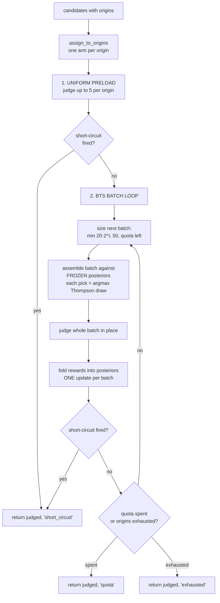

# Adaptive relevance-judging — a code walkthrough of `adaptive.py`

How `backend/testing/r_and_d/search_experiments/adaptive.py` spends a fixed, expensive
judging budget *where relevance is actually being found*, instead of judging the top-200 blind.
This is the **code-level** companion to the concept explainer
[`batched_thompson_sampling.md`](batched_thompson_sampling.md) — read that for *why* a bandit
and what Thompson Sampling is; read this for *how this module implements it*, line by line.

Spec: §4.3 Step 2 (judge pass 1) and Step 4 (judge pass 2). Faithful port of Paper Finder's
`agents/.../dense/relevance_loading_optimization.py` + `libs/dcollection/.../loaders/adaptive.py`.

---

## 1. The one idea: judging is a multi-armed bandit

v2 is **open-loop** — retrieve, judge the top ~200, done. The problem: most of those 200 are
dross, so most of the (LLM-priced) judgements are wasted. `adaptive.py` makes judging
**closed-loop** — judge a little, see which *origin* (which query/mechanism surfaced the paper)
is paying off, and spend the rest of the budget there.

The whole file is one re-mapping of the textbook bandit onto judging. Hold this table in your head
and the code reads straight off it:

| Bandit concept | Here (`adaptive.py`) | Code |
| --- | --- | --- |
| an **arm** | a candidate **origin** (`"keyword:q3"`, `"dense:q1"`, `"snowball_fwd:W12"`) | `assign_to_origins`, `_ThompsonArm` |
| **pulling** an arm | spending **one LLM judgement** on that origin's next-best candidate | `_next_from`, `_judge_and_record` |
| the **reward** | the judge's **0–3 level**, passed through `to_reward` (exponential) | `to_reward` |
| the **budget / traffic** | the fixed **judging quota** (~150/iteration, ~250/query) — the scarce thing | `quota` arg |
| a **batch** | ≤50 candidates judged before the next posterior update | the BTS loop |

> ★ Why "origin" is the right arm. Recall is about *coverage* — we want Perfects from as many
> productive mechanisms as possible. Origins are the natural unit of "a place relevance comes
> from," and they're exactly the tags the §4.7 attribution analysis reports on, so steering by
> origin and explaining by origin use the same axis.

---

## 2. The control flow at a glance



Three phases, three ways to stop (`StopReason = "quota" | "exhausted" | "short_circuit"`). The
rest of this doc is the four boxes that do the real work.

---

## 3. The reward: `to_reward` (the exponential)

```python
def to_reward(level: int | None) -> float:
    return ((2 ** float(level or 0)) / 8.0) - 0.125
```

$$\text{reward}(\ell) = \frac{2^{\ell}}{8} - 0.125$$

| level | meaning | reward |
| --- | --- | --- |
| 0 | Irrelevant | **0.000** |
| 1 | Somewhat | **0.125** |
| 2 | Highly | **0.375** |
| 3 | Perfect | **0.875** |

```
level 3  Perfect    ████████████████████████████████████  0.875
level 2  Highly     ███████████████                       0.375
level 1  Somewhat   █████                                 0.125
level 0  Irrelevant ▏                                     0.000
```

> ★ Why exponential, not linear. The metric being optimised is **recall@k_est**, which counts
> **Perfect/Highly** papers in the top window — so a judgement's *value to the objective* is not
> linear in its level. The exponential makes each level worth ≈2× the last: a Perfect is **2.3×**
> a Highly and **7×** a Somewhat (vs 1.5× / 3× under a linear `level/3`). That roughly *doubles
> the preference contrast* the bandit sees, so budget concentrates on Perfect-yielding origins.
> The `−0.125` shift pins **Irrelevant → exactly 0**, so a dead origin earns nothing and gets
> abandoned (a positive floor would keep useless arms alive). The `/8` and the 0.875 ceiling are
> incidental — Thompson sampling cares only about *relative spacing*, not absolute scale.

Ported **verbatim** from PF (`loaders/adaptive.py:141`), which uses the *same* mapping in two
places — the bandit reward *and* the DP budget-split — so it is PF's single "value of a
judgement" currency, not a one-off.

---

## 4. The arm: `_ThompsonArm` (windowed, decayed Normal)

Each origin keeps a posterior over its **mean reward**. Two design choices make it track a
*non-stationary* world:

```python
rewards: deque[float] = deque(maxlen=window_size)   # window_size = 20
```

- **Window** — only the last 20 rewards count (the `deque` drops the rest).
- **Decay** — within the window, the newest reward has weight 1 and older ones decay by
  `0.95**age` (`_weighted`).

> ★ Why forget the past? An origin's yield **falls as you read deeper** into its ranked list —
> the top hit is gold, page 3 is dross (depth-decay). A stationary average would keep an origin
> looking good long after its fresh hits dried up. Windowing + decay make the posterior mean
> *drop* as recent rewards turn to zeros, so the bandit walks away at the right moment.

The posterior over the mean is Normal, with variance shrinking in the **effective** sample count
$n_\text{eff} = \sum_k 0.95^k$:

$$\text{mean} = \frac{\sum_k w_k\, r_k}{\sum_k w_k}, \qquad
\text{sample} \sim \mathcal{N}\!\left(\text{mean},\; \frac{\sigma^2}{n_\text{eff}}\right),\quad \sigma^2 = 0.1$$

More (effective) observations → tighter posterior → less exploration. The standard Thompson
behaviour, only over a *recency-weighted* mean.

**Worked micro-example** (decay = 0.95). An arm reads three candidates in rank order and the
judge returns Perfect, then two duds — `levels = [3, 0, 0]`, so `rewards = [0.875, 0.0, 0.0]`:

| age $k$ (0 = newest) | reward | weight $0.95^k$ |
| --- | --- | --- |
| 0 (the 3rd, a dud) | 0.000 | 1.0000 |
| 1 (the 2nd, a dud) | 0.000 | 0.9500 |
| 2 (the 1st, Perfect) | 0.875 | 0.9025 |

$n_\text{eff} = 2.8525$, weighted mean $= \frac{0.875 \times 0.9025}{2.8525} = \mathbf{0.277}$ —
*below* the plain average (0.292), because the one Perfect is now the **oldest** thing in the
window. Two more duds and it keeps sinking; the arm cools off on its own.

```python
def sample(self, rng):
    mean, n_eff = self._weighted()
    if n_eff <= 0:
        return math.inf                       # never observed → explore first
    sd = math.sqrt(gaussian_variance / n_eff)
    return rng.gauss(mean, sd)
```

An **unobserved** arm samples `+inf`, so it's guaranteed to be picked before any explored arm —
optimism-under-uncertainty. (After the uniform preload every arm with candidates already has ≥1
observation, so `inf` mostly matters as a safety net.)

---

## 5. The arms' identities: `assign_to_origins`

```python
for origin in sorted(c.origins) if c.origins else [""]:   # under EVERY origin
    by_origin.setdefault(origin, []).append(c)
```

A candidate is filed under **every** origin that surfaced it (PF's default `multi_group_by`), and
**input order is preserved** inside each origin = the source's own rank order. A paper co-found by
`keyword:q1` and `snowball_fwd:W7` sits in *both* arms' queues.

> ★ Why every origin, not one. Each paper's `cursor` only advances when its arm is pulled, and
> the bandit deliberately starves cold arms (§3–4). If a co-found paper were filed under just one
> origin and that origin went cold, the paper would **never be judged** — even a relevant one,
> even one a *hot* arm also found. Filing it under every origin lets it be judged the moment
> *any* of its arms is pulled, so it rides its hottest route into the budget. This is the
> starvation fix: the dangerous case is a relevant paper co-surfaced by a cold origin and a hot
> one — multi-membership rescues it.

The cost of multi-membership is that the same paper now sits in several queues, so it must not be
judged (and paid for) twice. That is the **is-loaded guard** — the `claimed` set in
`adaptive_load`:

```python
claimed: set[str] = set()
def _next_from(origin):
    ...
    while i < len(queue):
        c = queue[i]; i += 1
        if c.paper_id not in claimed:     # skip anything already pulled via another arm
            cursor[origin] = i; claimed.add(c.paper_id); return c
    ...
```

A candidate is **claimed the instant it is selected** (in preload or a batch), so it is judged
exactly once — charged to whichever arm reached it first — and can't be double-pulled within a
batch either. Net effect: full coverage (no starvation) at **zero** extra judgements. Preserving
rank order still matters: preload and the bandit read each origin **best-first**, where the yield
is highest (the depth-decay assumption in §4 only holds if you read in rank order).

> ★ PF parity. This matches PF's default — `assign_to_origins(..., choose_best=False)` →
> `multi_group_by` (`relevance_loading_optimization.py:150-156`), judged-once via the
> `is_loaded(field)` filter. (PF also offers `choose_best=True`, a single best-*ranked* origin;
> we don't use it — full multi-membership eliminates starvation outright, whereas best-rank only
> reduces it.)

---

## 6. The stop rule: `HighlyRelevantShortcircuit`

```python
def should_break(self):
    return self.found_perfect and self.accumulated_score >= self.score_cap   # cap = 50
```

Accumulate **+2 per distinct Perfect**, **+1 per distinct Highly**, 0 for levels 0–1; stop once
there is **≥1 Perfect** *and* the score clears the cap. "Distinct" = dedup by `paper_id`, so
re-seeing a paper across batches can't inflate the count.

```
accumulated_score   +2 ── per distinct Perfect (level 3)
                    +1 ── per distinct Highly  (level 2)
                     0 ── Somewhat / Irrelevant
fire when:   found_perfect  AND  accumulated_score >= 50
```

> ★ The cap is deliberately high. `score_cap = 50` means ~25 Perfects (or 50 Highlys + a
> Perfect) before it triggers — it fires only when a query is genuinely *awash* in relevance and
> more judging would be wasteful. For most queries the loop stops on **`quota`**, not here. Note
> the scoring (`+2`/`+1`) is **integer counting**, distinct from `to_reward`'s exponential — two
> different jobs: `to_reward` *steers* the bandit, the short-circuit *halts* the loop. (Corrected
> 2026-06-17: PF accumulates level ≥ 2, not the earlier "+1/Somewhat" wording.)

The short-circuit is checked after the preload **and** after every batch (see the flowchart).

---

## 7. The loop: `adaptive_load`, phase by phase

### Phase 1 — Uniform preload

```python
for origin in by_origin:
    for _ in range(min(uniform_preload_size, quota - len(preload))):   # 5 per origin
        c = _next_from(origin); ...
await _judge_and_record([c for _, c in preload])
for origin, c in preload:
    arms[origin].observe(to_reward(c.level))
```

Judge up to **5 candidates from every origin** before any sampling, so no arm starts blind. This
is the bandit's "try everything once" bootstrap — without it, the very first Thompson draws would
be dominated by `+inf` arms in arbitrary order.

### Phase 2 — Batched Thompson Sampling

```python
target = min(initial_batch_size * batch_growth_factor**batch_idx,  # 20 · 2^i
             max_concurrency,                                       # 50
             quota - len(judged))                                   # don't overspend
while len(batch) < target:
    origin = max(live, key=lambda o: arms[o].sample(rng))   # argmax of Thompson draws
    c = _next_from(origin); batch.append((origin, c))
await _judge_and_record([c for _, c in batch])
for origin, c in batch:
    arms[origin].observe(to_reward(c.level))                # ONE update, after the batch
```

This is the subtle bit, and the reason it's called *Batched* TS:

> ★ Frozen posteriors during assembly. While a batch is being built, **no posterior updates
> happen** — every `arms[o].sample(rng)` reads the *stale* posterior from the last update. So a
> batch isn't "pick the best arm 50 times" (that would hammer one origin); it's 50 independent
> Thompson draws from frozen posteriors, which **spreads across origins by probability-matching**
> — better arms get *more* of the batch, but exploration survives. Only after the whole batch is
> judged do we fold all its rewards in with **one** `observe` sweep.

**The batch schedule** (`initial_batch_size=20`, `growth=2`, cap `max_concurrency=50`):

```
batch:   #0    #1    #2    #3   ...
target:  20 →  40 →  50 →  50  ...     (20·2^i, clamped to 50 and to quota-left)
```

Geometric growth, capped, means the number of "policy redeploys" (posterior updates) is
**O(log budget)**, not one-per-judgement:

```
quota = 150, 3 origins
  preload:  3 × 5  = 15 judged   → 1 update
  batch #0:        = 20 judged   → 1 update   (35 total)
  batch #1:        = 40 judged   → 1 update   (75 total)
  batch #2:        = 50 judged   → 1 update   (125 total)
  batch #3:        = 25 judged   → 1 update   (150 → quota)
  ───────────────────────────────────────────
  150 judgements, only 5 posterior updates
```

### Phase 3 — Stopping

`return judged, reason` with `reason ∈ {short_circuit, exhausted, quota}` — the loop exits the
moment the short-circuit fires, all origins run dry (`live` empty), or `len(judged)` hits `quota`.
Candidates are judged **in place** (`cand.level` set) and **exactly once** (the per-origin
`cursor` only moves forward).

---

## 8. End-to-end trace (illustrative)

Three origins after the 15-paper preload. Posterior means below are representative (real draws
are `rng.gauss`, seeded — this shows the *tendency*, not exact RNG output):

| origin | preload levels | rewards | posterior mean ≈ |
| --- | --- | --- | --- |
| `keyword:q1` (rich) | 3,2,3,2,1 | .875,.375,.875,.375,.125 | **0.52** |
| `dense:q1` (medium) | 2,1,0,1,0 | .375,.125,0,.125,0 | **0.13** |
| `snowball_fwd:W7` (poor) | 0,0,1,0,0 | 0,0,.125,0,0 | **0.03** |

```
Thompson draws (frozen posteriors) → batch #0 of 20, by probability-matching:

  keyword:q1     ███████████████  ~15 picks   (highest mean → most of the batch)
  dense:q1       ████              ~4 picks    (still sampled — exploration)
  snowball_fwd   █                 ~1 pick

judge the 20 → fold rewards in (one update). keyword:q1 keeps paying (more Perfects) so
its posterior stays high and it dominates batch #1; if its deeper pages turn to zeros,
windowing drags its mean down and dense/snowball reclaim share. Loop ends on `quota`
(or `short_circuit` if Perfects pile past the cap).
```

The payoff vs v2's open loop: the same ~150 judgements buy far more Perfects, because the budget
flowed to `keyword:q1` instead of being spread flat across all three origins' dross.

---

## 9. Provenance & faithfulness

- **Verbatim from PF** (deterministic, mechanism-critical): `to_reward`
  (`loaders/adaptive.py:141`) and the `HighlyRelevantShortcircuit` scoring
  (`relevance_loading_optimization.py`).
- **Algorithm re-implemented, not the plumbing.** PF wraps AI2's *fork* of `mabwiser`
  (`LearningPolicy.BatchedThompsonSampling`, a custom policy). We reimplement the algorithm in
  ~1 file over our own `Candidate` — no numpy/mabwiser dependency — which keeps it transparent,
  **deterministic** (seeded `random.Random`), and instrumentable for §4.7 origin attribution.
- **Constants** are frozen in `config.Adaptive` (preload 5, batch 20×2 capped 50, window 20,
  decay 0.95, variance 0.1, cap 50, +2/+1), ported from PF `config.toml`
  `[default.relevance_judgement]`.
- **Multi-origin + is-loaded guard (§5):** faithful to PF's default `multi_group_by` — a
  co-surfaced paper is filed under every arm and judged once via the `claimed` guard, so the
  bandit can't strand a relevant paper behind a starved queue.

> ★ Bottom line
> `adaptive.py` is the **budget-shaped half** of the closed loop: a recency-aware bandit over
> *origins* that pours a fixed judging quota into whichever mechanisms are surfacing Perfects,
> with an exponential reward that makes "Perfect" the thing worth chasing and a high-water-mark
> short-circuit that bails early when a query is clearly rich. The
> [snowball explainer](citation_snowballing.md) is the graph-shaped half; the
> [BTS explainer](batched_thompson_sampling.md) is the theory behind the bandit.
