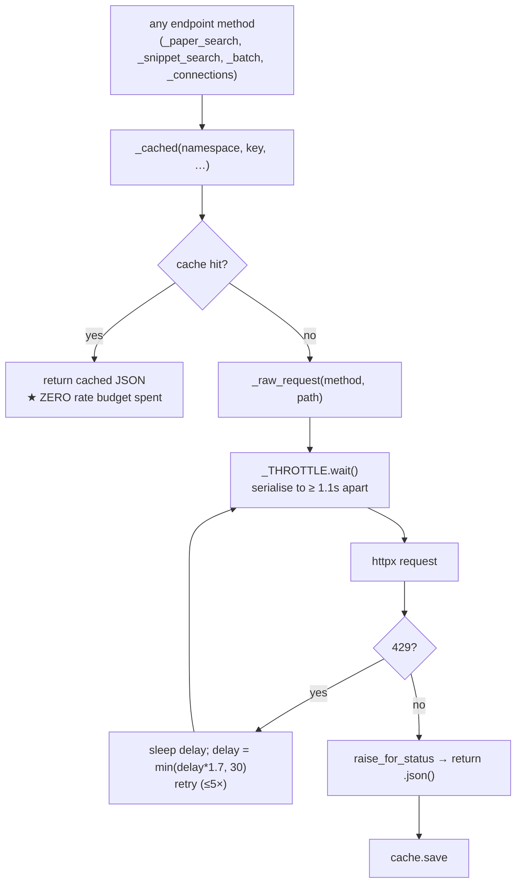

# The Semantic Scholar source client — a code walkthrough of `s2_client.py`

How `backend/testing/r_and_d/search_experiments/retrieval/s2_client.py` implements `S2Source`,
the Arm C `SourceClient` the shared `broad_search` pipeline drives against Semantic Scholar.
This is a **code-level** walkthrough — read it for *how each important function works and why it
exists*. For the surrounding architecture (the `SourceClient` protocol, the B↔C divergence) see
the spec; for the bandit that decides *which* of these candidates get judged see
[`adaptive_judging.md`](adaptive_judging.md).

Spec: §4.3a (Arm C / S2 source), §4.3 diffs #1–#4 (what S2 has that OpenAlex doesn't), §7 (the
cost finding this client dominates).

---

## 1. The one idea: S2 is the *fully-capable* source

Every other source client leaves parts of the shared pipeline dark. `S2Source` is the one that
turns all of it on — its `caps` are all-`True`:

```python
caps = Capabilities(
    has_dense=True,          # the /snippet/search dense leg          (§4.3 #1)
    has_influential=True,    # isInfluential edge flag in snowball     (§4.3 #2)
    has_snippets=True,       # num_snippets → the snippet blend term   (§4.3 #3)
    native_abstracts=True,   # abstract/tldr inline — no Crossref hop  (§4.3 #4)
)
```

`broad_search` reads these flags and *only then* calls `dense_search`, folds the snippet term in
`ranking.py`, and reads `is_influential` in `snowball.py`. So this file is where the four §4.3
"things S2 has that OpenAlex lacks" physically become real. Hold this mapping in your head and the
methods read straight off it:

| Capability | What it lights up | Method(s) in this file |
| --- | --- | --- |
| `has_dense` | the dense retrieval leg | `dense_search` → `_snippet_search` + `_batch` |
| `has_influential` | forward-snowball influence term | `fetch_citations` (sets `is_influential`) |
| `has_snippets` | snippet-count signal in the blend | `dense_search` sets `cand.num_snippets` |
| `native_abstracts` | text without a Crossref enrich hop | `_paper_to_candidate` (abstract → tldr) |

---

## 2. The real engineering problem: 1 request/second, cumulative

S2's free tier allows **1 request/second across *all* endpoints combined** — not per-endpoint, not
per-client. Almost every interesting decision in this file is an answer to that one constraint.
There are two layers.



The ordering in that diagram is the whole trick: **cache is checked *before* the throttle**, so a
cache hit never touches the 1 req/s budget. That is what makes a rerun of the experiment, and the
per-seed forward snowball (one citations call *per relevant paper*), affordable at all.

> ★ Why this client dominates Arm C wall-time. With a hard 1 req/s ceiling, runtime is essentially
> `(number of cache-missing requests) × 1.1s`. The §7 cost finding isn't about LLM tokens — it's
> this throttle. The cache is therefore not a nicety; it's the only reason the arm finishes.

### `_RateThrottle.wait` — a *global* serialiser

```python
async def wait(self) -> None:
    async with self._lock:                       # one request in flight at a time
        if self._last is not None:
            wait_for = self._min - (self._clock() - self._last)
            if wait_for > 0:
                await self._sleep(wait_for)
        self._last = self._clock()
```

Three things make this correct for the constraint:

1. **It's a module singleton** (`_THROTTLE = _RateThrottle(CONFIG.s2_min_request_interval_s)`,
   created once at import). The limit is *cumulative*, so a per-instance throttle would let two
   `S2Source` objects double the rate. One global object is the only thing that honours "across all
   endpoints."
2. **The `asyncio.Lock` enforces one-in-flight.** Holding the lock across the sleep means concurrent
   coroutines queue rather than all reading the same stale `_last` and firing together.
3. **`clock`/`sleep` are injectable.** Tests pass a fake clock and a no-op sleep, so throttle logic
   is verified without ever sleeping a real second. `_min` is `1.1`, not `1.0` — a small buffer
   above the documented limit to absorb clock jitter and avoid tripping 429s in the first place.

### `_raw_request` — throttle + exponential back-off

`wait()` *prevents* most 429s; `_raw_request` *survives* the ones that slip through. On a 429 it
sleeps `delay` and grows it geometrically (`delay = min(delay * 1.7, 30)`), retrying up to 5 times
before giving up. Any non-429 error goes straight through `raise_for_status()` — back-off is
reserved for rate-limiting, not for genuine 4xx/5xx bugs.

### `_cached` — the cache-before-throttle wrapper

```python
async def _cached(self, namespace, key, path, *, params=None, json_body=None, method="GET"):
    async def _produce():
        return await self._raw_request(method, path, params=params, json_body=json_body)
    return await _cache.cached(namespace, key, _produce)
```

`_produce` is a thunk — `_cache.cached` runs it **only on a miss**. Every endpoint method below
funnels through here, which is what guarantees the "hit = zero budget" property holds everywhere
rather than at one call site someone remembered to optimise.

---

## 3. The pure mappers (no network — offline-testable)

S2 returns three differently-shaped JSON blobs (search rows, batch rows, citation/reference edges).
These small functions normalise all of them to the pipeline's `Candidate`, and they're pure so the
tests exercise them with fixture dicts and no HTTP.

### `_corpus_id` — the one identity that matters

```python
def _corpus_id(paper: dict) -> str | None:
    cid = paper.get("corpusId")                          # batch shape
    if cid is None:
        cid = (paper.get("externalIds") or {}).get("CorpusId")  # search/edge shape
    return str(cid) if cid is not None else None
```

`paper_id` throughout the experiment is the S2 **corpusId** — because that's the id BENCH scores
against (§3). The annoyance this papers over: batch responses put it at the top level as `corpusId`,
while search and edge responses bury it in `externalIds.CorpusId`. Normalising to `str` here means
dedup and scoring never have to care which endpoint a candidate came from.

### `_paper_to_candidate` — text precedence baked in

Maps a paper dict to a `Candidate`, choosing body text as **`abstract` → `tldr.text` → (None)** and
recording which one won in `text_basis`. That `text_basis` tag matters downstream: the judge and the
metrics can tell a real abstract from a one-line tldr from a bare snippet, so a paper judged on thin
text isn't silently treated as equivalent to one judged on a full abstract.

### `_group_snippets` — collapse passages to papers

`/snippet/search` returns one row *per matching passage*, so the same paper can appear many times.
This groups rows by corpusId and, crucially, **counts them** (`entry["n"] += 1`). That count becomes
`num_snippets` — a cheap proxy for "how strongly the dense index matched this paper," and exactly the
signal the §4.3 #3 snippet blend term consumes.

---

## 4. `dense_search` — the marquee function (a two-call dance)

This is the most important method in the file and the one most worth understanding, because it
exists to work around a real S2 limitation.

```python
async def dense_search(self, query: str, limit: int) -> list[Candidate]:
    grouped = _group_snippets(await self._snippet_search(query, limit))     # call 1: sparse
    cids = list(grouped)
    hydrated = {c: p for p in await self._batch(cids, _PAPER_FIELDS) if (c := _corpus_id(p))}  # call 2

    cands = []
    for cid, info in grouped.items():
        paper = hydrated.get(cid)
        cand = _paper_to_candidate(paper) if paper else Candidate(paper_id=cid, title=info["title"])
        if cand is None:
            continue
        cand.num_snippets = info["n"]                       # dense-match strength
        if not cand.abstract and info["snippet"]:
            cand.abstract = info["snippet"]                 # fall back to snippet text…
            cand.text_basis = "snippet"                     # …and say so
        cands.append(cand)
    return cands
```

**Why two calls?** `/snippet/search` is the dense/semantic index, but it returns *sparse* papers —
corpusId, title, and the matching snippet text, and nothing else. Ranking needs `year` and
`citationCount`; the judge needs body text. So step 2 hydrates the corpusIds via `/paper/batch`
(up to 500 ids/request), which is PF's exact resolution strategy — except PF lazy-loads those
fields later and this single-pass pipeline does it eagerly, because it's going to judge and rank
*every* candidate anyway.

The fallback chain is the careful part: if batch can't fill a paper (S2 returns `null` for ids it
doesn't know), the candidate is still kept — built from the snippet's title, its abstract set to the
snippet text, and `text_basis="snippet"` so nothing downstream mistakes thin text for a real
abstract. A dense hit is never dropped just because hydration missed.

> ★ The two calls cost two slots of the 1 req/s budget per query (one `/snippet/search`, plus one
> `/paper/batch` per ≤500 ids). Batching the hydration into a single request — rather than one
> `/paper/{id}` per hit — is a direct concession to the throttle: 50 dense hits cost 1 batch call,
> not 50.

---

## 5. The other `SourceClient` surfaces (briefly)

These are thinner because the pure mappers already do the work.

| Method | Endpoint | What's notable |
| --- | --- | --- |
| `keyword_search` | `/paper/search` (relevance) | No enrichment hop — S2 returns abstract/tldr inline (`native_abstracts`). Paginates by `offset` to `limit` (≤100/page, offset+limit ≤ 1000). |
| `suggest` / `_ground_one` | LLM titles → `/paper/search` | The parametric leg: an LLM proposes titles, each is *grounded* against S2 by title within a ±2yr server-side window; trusts S2's top relevance hit. |
| `fetch_citations` | `/paper/CorpusId:{id}/citations` | **Forward snowball.** Reads the per-edge `isInfluential` flag into `cand.is_influential` — the §4.3 #2 signal OpenAlex structurally cannot provide. |
| `fetch_references` | `/paper/CorpusId:{id}/references` | **Backward snowball.** No influence term — PF carries influence forward only, and this stays faithful to that. |

### Formulation is delegated — and split per leg

S2 has *two* retrieval legs that want *different* query shapes, so formulation is split in two
(mirroring Paper Finder's two-agent design):

```python
# KEYWORD leg  -> keyword_s2.py (short content-keyword queries; /paper/search is keyword-ish)
async def formulate_keyword_queries(self, content, n):           return _formulate_keyword(content, n)
async def reformulate_keyword_queries(self, content, ex, n):     return _reformulate_keyword(content, ex, n)
# DENSE leg    -> dense_s2.py (verbose natural-language queries; the snippet index can't use operators)
async def formulate_dense_queries(self, content, n):             return _formulate_dense(content, n)
async def reformulate_dense_queries(self, content, ex, n):       return _reformulate_dense(content, ex, n)
```

The dense methods hand off to [`dense_s2.py`](../../backend/testing/r_and_d/search_experiments/retrieval/dense_s2.py)
(natural language, no operators); the keyword methods hand off to
[`keyword_s2.py`](../../backend/testing/r_and_d/search_experiments/retrieval/keyword_s2.py) (a port of
PF's `_broad_search_prompt_tmpl`, stripping the topic to content-keywords). This split exists because
feeding the dense NL query to `/paper/search` returned **zero** results — S2's relevance endpoint is
keyword-ish (see `FINDINGS.md`, 2026-06-23). The shared loop (`broad_search.py`) formulates each leg
in its own idiom and only calls the dense pair when `caps.has_dense`, so `s2_client.py` stays a pure
*transport + mapping* layer and the loop stays source-agnostic.

---

## 6. The endpoint helpers, in one table

All four go through `_cached` → `_raw_request` → `_THROTTLE`, so all four are throttle- and
cache-aware for free.

| Helper | Endpoint | Paging strategy | Page cap |
| --- | --- | --- | --- |
| `_paper_search` | `/paper/search` | `offset` until `next` is null or `limit` reached | 100/page, offset+limit ≤ 1000 |
| `_snippet_search` | `/snippet/search` | single call (top-k) | ≤ 1000 |
| `_batch` | `/paper/batch` (POST) | chunk ids, skip `null` rows | 500 ids/request |
| `_connections` | `/{citations,references}` | `offset` to `_GRAPH_FETCH_CAP` | 1000/page, cap = `snowball_top_k` (200) |

`_connections` bounds its fan-out at `CONFIG.budgets.snowball_top_k` (200) so a single
mega-cited seed paper can't blow the whole rate budget on one snowball expansion.

---

## 7. End-to-end: one dense query, traced

```
dense_search("methods for raising school attendance", 50)
  │
  ├─ _snippet_search → _cached("s2.snippet_search", …) ─┐
  │     miss → _THROTTLE.wait() (≤1.1s) → /snippet/search → 50 passage rows  [budget: 1]
  │                                                         │
  ├─ _group_snippets → 31 unique papers, each with n_snippets + best snippet
  │
  ├─ _batch(31 cids) → _cached("s2.batch", …) ────────────┐
  │     miss → _THROTTLE.wait() (≤1.1s) → /paper/batch → 29 hydrated, 2 null  [budget: 1]
  │
  └─ merge: 29 papers get real abstract+year+cites (text_basis="abstract"),
            2 fall back to snippet text (text_basis="snippet"),
            all 31 carry num_snippets → returned to broad_search
```

Two requests, ~2.2s if cold, ~0s if cached. Those 31 candidates then flow into the
adaptive judge ([`adaptive_judging.md`](adaptive_judging.md)), where `num_snippets` and the
hydrated metadata earn their keep in the ranking blend.

---

## Summary

`s2_client.py` is the transport-and-mapping layer for the only fully-capable source in the
experiment. Read it as three concentric rings:

1. **Constraint plumbing** (`_RateThrottle`, `_raw_request`, `_cached`) — everything bows to the
   cumulative 1 req/s limit, and **cache-before-throttle** is the decision that makes the arm
   affordable.
2. **Pure mappers** (`_corpus_id`, `_paper_to_candidate`, `_group_snippets`) — normalise three
   JSON shapes to one `Candidate`, offline-testable.
3. **`SourceClient` surface** (`dense_search` first among equals, then keyword/suggest/snowball) —
   where the four §4.3 capabilities become real, with `dense_search`'s sparse-then-hydrate dance
   the one function most worth knowing.
