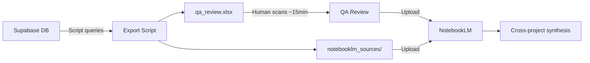
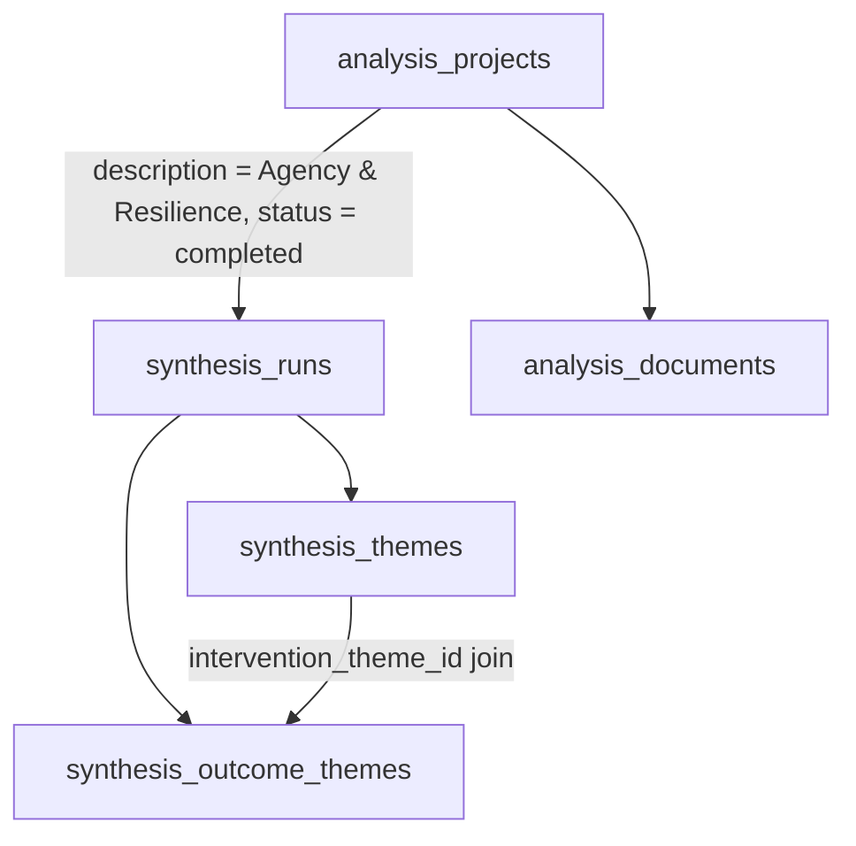

# Agency & Resilience Cross-Project Export Script

## Context

12 Policy Atlas searches with description "Agency & Resilience" span different facets of the topic (individual adaptive capacity, community infrastructure, institutional reform, etc.). The current Policy Atlas UI shows per-project results but cannot synthesise across projects. This script exports structured data from Supabase into two output types: a QA spreadsheet for human review, and markdown files for NotebookLM ingestion.

## Workflow

## Script Location and Dependencies

- Script: `[scripts/exports/export_agency_resilience.py](scripts/exports/export_agency_resilience.py)`
- Dependencies: `[scripts/exports/requirements.txt](scripts/exports/requirements.txt)` containing `supabase`, `pandas`, `openpyxl`, `python-dotenv`
- Outputs written to `scripts/exports/output/` (qa_review.xlsx + notebooklm_sources/ folder)
- Reads `SUPABASE_URL` and `SUPABASE_KEY` from `[backend/.env](backend/.env)` using `python-dotenv`
- Uses `create_client` from `supabase` package (same pattern as `[backend/app/services/vectorization.py](backend/app/services/vectorization.py)`)

## Data Flow

The script queries these tables in sequence:

Key filter: outcome themes are filtered to `verdict_label != 'insufficient_evidence'` for the QA spreadsheet tabs 2-3, the intervention evidence analysis file, and the outcomes-as-dimensions file.

## Output 1: QA Spreadsheet (`qa_review.xlsx`)

### Tab 1: Projects (15 columns)

One row per completed project.

- **Project Title** — `analysis_projects.title`
- **Project Link** — constructed: `https://discoverypolicyatlas-production.up.railway.app/public/projects/{id}`
- **Date Run** — `analysis_projects.created_at` (formatted as date)
- **Run By** — `analysis_projects.created_by_name`
- **Relevant References** — `analysis_projects.relevant_references`
- **Evidence Year Range** — calculated from `synthesis_runs.evidence_coverage.years` (min-max keys)
- **Countries Covered** — count of keys in `evidence_coverage.countries`
- **Top 3 Countries** — top 3 by value from `evidence_coverage.countries`
- **Source Type Breakdown** — formatted from `evidence_coverage.source_types`
- **Top Evidence Categories** — formatted from `evidence_coverage.evidence_categories`
- **Intervention Theme Count** — count of `synthesis_themes` where `theme_type = 'intervention'`
- **Outcome Theme Count (sufficient evidence)** — count of `synthesis_outcome_themes` where `verdict_label != 'insufficient_evidence'`
- **Search Filters** — combined `search_query.population`, `.inner_setting`, `.outcome` (show "None" if all empty)
- **Geography Filter** — `search_query.geography`
- **Time Filter** — `search_query.time_preset` or `time_from`-`time_to`

### Tab 2: Intervention Themes (11 columns)

One row per intervention theme across all projects.

- **Project Title** — from parent project
- **Intervention Name** — `synthesis_themes.theme_name`
- **Summary Description** — `synthesis_themes.summary_description` (full text)
- **Source Documents** — `synthesis_themes.frequency`
- **Effect Consensus** — `synthesis_themes.effect_consensus`
- **Positive / Negative / Null** — formatted as "X / Y / Z"
- **Outcome Verdicts & Magnitudes** — formatted string combining outcome name, verdict, and magnitude for each sufficient-evidence outcome linked via `intervention_theme_id`. E.g., "Mental health: suggested_positive (marginal); Caregiver burden: suggested_positive (marginal)"
- **Geography Context Fit** — `synthesis_themes.transferability_breakdown.geography`
- **Geography Context Explanation** — `synthesis_themes.transferability_breakdown.notes.geography`
- **Countries** — `synthesis_themes.countries`
- **Study Types** — formatted from `synthesis_themes.study_types` JSON

### Tab 3: Outcome Themes (9 columns)

One row per outcome theme, filtered to `verdict_label != 'insufficient_evidence'`.

- **Project Title** — from parent project
- **Outcome Name** — `synthesis_outcome_themes.outcome_name`
- **Outcome Description** — `synthesis_outcome_themes.outcome_description`
- **Linked Intervention** — resolved from `intervention_theme_id` to `synthesis_themes.theme_name`
- **Verdict** — `synthesis_outcome_themes.verdict_label`
- **Predicted Magnitude** — `synthesis_outcome_themes.predicted_magnitude`
- **Effect Direction** — `synthesis_outcome_themes.effect_consensus`
- **Positive / Negative / Null** — formatted as "X / Y / Z"
- **Causal Mechanism** — `synthesis_outcome_themes.primary_causal_mechanism`

## Output 2: NotebookLM Sources (`notebooklm_sources/`)

17 markdown files, each a standalone source for NotebookLM (well within the 50-source limit).

### `00_cross_project_overview.md`

- Lists all completed projects with: title, project link, date run, run by, relevant reference counts, evidence year range, countries covered, top 3 countries, source type breakdown, top evidence categories, search filters (population/setting/outcome), geography filter, time filter
- Aggregate stats: total sources across all projects, country coverage, year range, source type mix

### `01` through `11`: Per-project briefings (numbered by project)

Each file named like `01_interventions_individual_adaptive_capacity.md` (slugified from title). Contains:

- **Core answer and directive** from `synthesis_runs.structured_briefing_data.core_answer`
- **Policy background** from `structured_briefing_data.background_section`
- **Synthesis sections** from `structured_briefing_data.synthesis_sections` (rendered as headed bullet lists)
- **Recommendations** from `structured_briefing_data.recommendations` (numbered, with implementation options)
- **Flattened interventions table** from `structured_briefing_data.interventions_table` (intervention name, context, impact narrative, key study description, delivery features)
- **Issue themes** from `synthesis_themes` where `theme_type = 'issue'` (name + description)
- **Risk themes** from `synthesis_themes` where `theme_type = 'risk'` (name + description + harm warning flag)

### `12_source_documents_registry.md`

- All relevant documents (`analysis_documents` where `is_relevant = true`) across all projects
- Grouped by project, each entry: title, authors, year, evidence category, top-line finding, DOI, citation count, source country

### `13_intervention_evidence_analysis.md`

- Mirrors QA Tab 2 data in prose form
- For each intervention theme: name, project, description, source document count, effect consensus, positive/negative/null counts, geography context fit + explanation, study types, countries
- Outcome breakdown table (sufficient evidence only): outcome name, verdict, magnitude, direction, +/-/null
- Brief auto-generated summary sentence per intervention characterising the evidence picture

### `14_issues_and_problem_space.md`

- All issue-type synthesis themes across all projects
- Grouped by project: theme name, description, frequency

### `15_outcomes_as_dimensions.md`

- Organised by **outcome name** (not by project/intervention)
- For each distinct outcome name, lists all instances across projects and interventions (sufficient evidence only)
- Table per outcome: intervention name, project, verdict, magnitude, direction, +/-/null, causal mechanism
- Auto-generated pattern note per outcome (e.g., "most frequently measured", "consistently positive direction")

### `16_risks_and_implementation.md`

- All risk-type synthesis themes across all projects
- Organised by project, then by intervention within each project using `linked_intervention_theme_id` to associate each risk with its parent intervention
- Structure: Project heading > Intervention subheading > Risk themes under that intervention (name, description, frequency, harm warning flag)
- Within each intervention, risks ordered by frequency (most common first), with harm-warning risks surfaced at the top
- Any risks without a `linked_intervention_theme_id` (if any) listed under an "Unlinked Risks" section at the end of the project

## Script Structure

Single file `export_agency_resilience.py` with these functions:

- `load_config()` — loads env vars from `backend/.env`, returns Supabase client
- `fetch_projects(client)` — queries completed Agency & Resilience projects
- `fetch_project_data(client, project)` — for a given project, fetches synthesis_runs, synthesis_themes, synthesis_outcome_themes, analysis_documents. Returns a structured dict
- `build_intervention_theme_lookup(themes)` — creates id-to-name mapping for resolving outcome theme links
- `format_outcome_verdicts(outcomes, theme_lookup)` — builds the formatted verdict & magnitude string for Tab 2
- `generate_qa_spreadsheet(all_project_data, output_path)` — builds the 3-tab Excel workbook using pandas + openpyxl
- `generate_notebooklm_sources(all_project_data, output_path)` — generates all 17 markdown files
- `main()` — orchestrates everything, prints progress

## Key Implementation Details

- **Supabase client**: `create_client(url, key)` from `supabase` package, using PostgREST-style queries: `.table("x").select("*").eq("col", val).execute()`
- **Outcome filtering**: apply `verdict_label != 'insufficient_evidence'` filter when building Tab 2 column 7, Tab 3 rows, file 13, and file 15
- **Intervention theme lookup**: query all `synthesis_themes` where `theme_type = 'intervention'`, build `{id: theme_name}` dict for resolving `intervention_theme_id` on outcome themes
- **Geography context fit**: extract from `transferability_breakdown.geography` and `transferability_breakdown.notes.geography` on intervention themes (these are JSON fields, may be null)
- **Structured briefing rendering**: the `structured_briefing_data` field is a rich JSON object; render each sub-field as markdown sections with proper heading hierarchy
- **File naming**: per-project files use zero-padded index + slugified title (truncated to ~50 chars), e.g., `03_interventions_community_social_capital.md`

